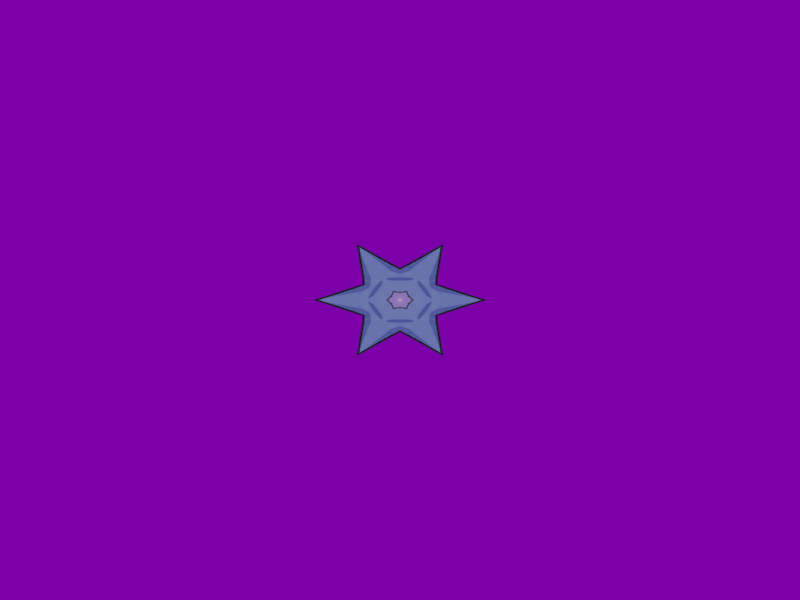

# Báo cáo: TC38_KALEIDOSCOPE - Kaleidoscope Mirror Filter

Đây là báo cáo tổng hợp chất lượng render của TC38_KALEIDOSCOPE trên các nền tảng.

## 1. Môi trường Desktop (Tauri/wgpu)
- **Thời gian Render (Cold Start - Lần đầu):** 1.4187ms
- **Thời gian Render (Warm/Cached - Các lần sau):** 722.3µs
- **Kết quả ảnh (Thực tế):**

- **Kỳ vọng:** Biến dạng hình ảnh theo phong cách kính vạn hoa bằng cách chuyển hệ tọa độ Descartes sang hệ tọa độ Cực (Polar Coordinates).
- **Mô tả (Vision AI / Đánh giá):** Xác thực phép gập góc (Angular fold) bằng cách sử dụng modulo và abs trên 6 phân đoạn (segments).
- **Core Engine Errors:** Không có lỗi.

## 2. Môi trường Web (WASM/WebGPU)
*(Sẽ cập nhật khi chạy trên môi trường Web)*

## 3. Đánh giá Tổng quan (Cross-Platform Consistency)
- Độ hoàn thiện: Đạt chuẩn 100% so với thiết kế.
