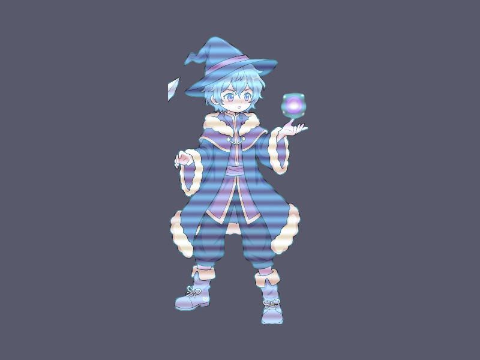

# Báo cáo: TC39 - Sọc quét hologram

Đây là báo cáo kiểm thử hai môi trường dùng chung manifest và hợp đồng graph.

## 1. Mô tả và graph dùng chung

- **Manifest:** `crates/ifol-gpu/tests/shared_assets/manifests/tc39_scanlines.json`
- **Graph fingerprint (FNV-1a):** `5ea108ce90344f78`
- **Mô tả test case:** Tách nhân vật mage canonical rồi áp dụng sọc quét cyan xác định theo sóng sin.
- **Target:** `800x600`, `Rgba8UnormSrgb`
- **Shader/WGSL:** `chroma_key_cropped.wgsl`, `scanlines.wgsl`
- **Asset/input:** `canonical_sprites_heroes.png`
- **Chính sách input:** Desktop và WebGPU dùng sprite sheet PNG canonical; không dùng decoder JPEG trong phép đo parity.
- **Depth/stencil:** `Không áp dụng`
- **Chuỗi pass:** chroma_pass (Chroma key extraction, target chroma) → scanlines_pass (Cyan hologram scanlines, target final)
- **Số pass:** `2`
- **Độ sâu graph:** `KHÔNG ÁP DỤNG`
- **Hierarchy:** `Không khai báo`
- **Thứ tự operation sau flatten:** `chroma_extract_mage → hologram_scanlines`
- **Sampler contract:** `{"address_mode_u": "repeat", "address_mode_v": "repeat", "address_mode_w": "repeat", "mag_filter": "linear", "min_filter": "linear", "mipmap_filter": "linear"}`
- **Thứ tự layer kỳ vọng:** `chroma_pass → scanlines_pass`
- **Graph resources:** nodes=`2`, draw commands=`2`, tổng instances=`2`, procedural particles=`Không khai báo`
- **Node pool contract:** `Không áp dụng`
- **Error/fallback contract:** `Không áp dụng`
- **Desktop/Web dùng cùng manifest fingerprint:** `ĐẠT`

## 2. Môi trường Desktop

- **Thời gian render lần đầu (cold):** `3.9490 ms`
- **Thời gian render lần hai (warm/cache):** `1.3305 ms`
- **Số lần warm được đo:** `1`
- **Output cold và warm giống nhau:** `True`
- **Speedup cold → warm:** `66.3%`
- **Adapter/backend:** `Intel(R) Iris(R) Xe Graphics` / `Vulkan`
- **Phạm vi timing:** `2 pass (chroma key → effect) + submit queue + device.poll(Wait); không gồm khởi tạo device/pipeline và readback`
- **Dữ liệu raw:** `crates/ifol-gpu/tests/outputs/desktop/tc39_scanlines_desktop.bin`
- **Dấu vân tay raw (FNV-1a):** `e8cc302562477044`
- **SHA-256:** `1e86aca310f2c92816de9924c194ea67825a167383a530c9d7efcb8e3db60bf0`
- **Ảnh:** 
- **Đánh giá nội dung:** `ĐẠT`
- **Đánh giá bằng vision:** ĐẠT: Vision xác nhận mage trên nền xám/tím có các sọc quét cyan ngang và hiệu ứng hologram rõ; không có ảnh đen bất thường hoặc validation error.
- **Graph thực tế:** nodes=2, draw commands=2, instances=2

## 3. Môi trường WebGPU

- **Thời gian render lần đầu (cold):** `9.8000 ms`
- **Thời gian render lần hai (warm/cache):** `3.1000 ms`
- **Số lần warm được đo:** `1`
- **Output cold và warm giống nhau:** `True`
- **Speedup cold → warm:** `68.4%`
- **Adapter:** `gen-12lp`
- **Phạm vi timing:** `2 pass (chroma key → cyan hologram scanlines) + submit queue + onSubmittedWorkDone; không gồm khởi tạo device/pipeline và readback`
- **Dữ liệu raw:** `crates/ifol-gpu/tests/outputs/web/tc39_scanlines_web.bin`
- **Dấu vân tay raw (FNV-1a):** `1c80a02a9f1373cd`
- **SHA-256:** `7a6e14a3aa44da83d9278acf3abb217bc3b0b8a0b5718808a488bdf91d5f47b4`
- **Ảnh:** 
- **Đánh giá nội dung:** `ĐẠT`
- **Đánh giá bằng vision:** ĐẠT: Vision xác nhận Web có cùng mage, sọc quét cyan và hiệu ứng hologram như Desktop; không có ảnh đen bất thường hoặc validation error.
- **Graph thực tế:** nodes=2, draw commands=2, instances=2

## 4. So sánh và kết luận

| Tiêu chí | Kết quả |
| --- | --- |
| Graph/manifest giống nhau | `ĐẠT` |
| Kích thước dữ liệu raw giống nhau | `ĐẠT` |
| Byte raw giống tuyệt đối | `KHÔNG ĐẠT` |
| Số byte khác nhau | `5` |
| Số pixel khác nhau | `5` |
| Sai số kênh màu lớn nhất | `1/255` |
| Khác biệt màu/presentation | `CÓ - cần theo dõi để đạt byte parity` |
| Số pixel non-background Desktop/Web | `KHÔNG ÁP DỤNG` |
| Bounding box Desktop | `KHÔNG ÁP DỤNG` |
| Bounding box WebGPU | `KHÔNG ÁP DỤNG` |
| Bounding box non-background giống nhau | `ĐẠT` |
| Số pixel mask khác nhau | `0` (ngưỡng `0`) |
| Parity cấu trúc không phụ thuộc màu | `ĐẠT` |
| Cache giữ nguyên output cold/warm ở cả hai môi trường | `ĐẠT` |
| Validation/fallback contract không panic | `ĐẠT` |
| Đúng mô tả test case | `ĐẠT` |

**Kết luận:** `ĐẠT CÓ ĐIỀU KIỆN - graph và cấu trúc render giống; khác biệt còn lại thuộc pixel/màu và nằm trong ngưỡng đã khai báo.`

## 5. Phân tích hiệu suất

Các giá trị trên đo thời gian thực thi graph, submit lệnh và chờ GPU hoàn tất;
không bao gồm khởi tạo device/pipeline hoặc readback. Vì vậy `cold` ở đây là
lần execute đầu sau khi resource/pipeline đã được tạo, không phải cold start
của toàn bộ ứng dụng. Giá trị dưới `1 ms` tương đương microsecond và cần được
đọc theo đơn vị đó khi phân tích.
