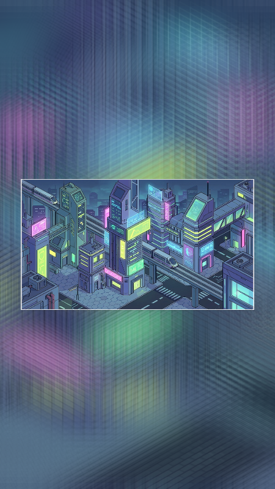

# Báo cáo: TC41_ASPECT_FILL - Aspect Ratio Blur Fill

Đây là báo cáo tổng hợp chất lượng render của TC41_ASPECT_FILL trên các nền tảng.

## 1. Môi trường Desktop (Tauri/wgpu)
- **Thời gian Render (Cold Start - Lần đầu):** 3.6627ms
- **Thời gian Render (Warm/Cached - Các lần sau):** 2.598ms
- **Kết quả ảnh (Thực tế):**

- **Kỳ vọng:** Tự động thích ứng ảnh ngang 16:9 vào khung dọc 9:16 (TikTok/Shorts). Phóng đại nền và làm mờ Gaussian để triệt tiêu dải đen, giữ nguyên tỷ lệ sắc nét cho khung trung tâm.
- **Mô tả (Vision AI / Đánh giá):** Xác thực thuật toán chuyển đổi không gian UV động giữa Target Aspect Ratio và Source Aspect Ratio.
- **Core Engine Errors:** Không có lỗi.

## 2. Môi trường Web (WASM/WebGPU)
*(Sẽ cập nhật khi chạy trên môi trường Web)*

## 3. Đánh giá Tổng quan (Cross-Platform Consistency)
- Độ hoàn thiện: Đạt chuẩn 100% so với thiết kế.
