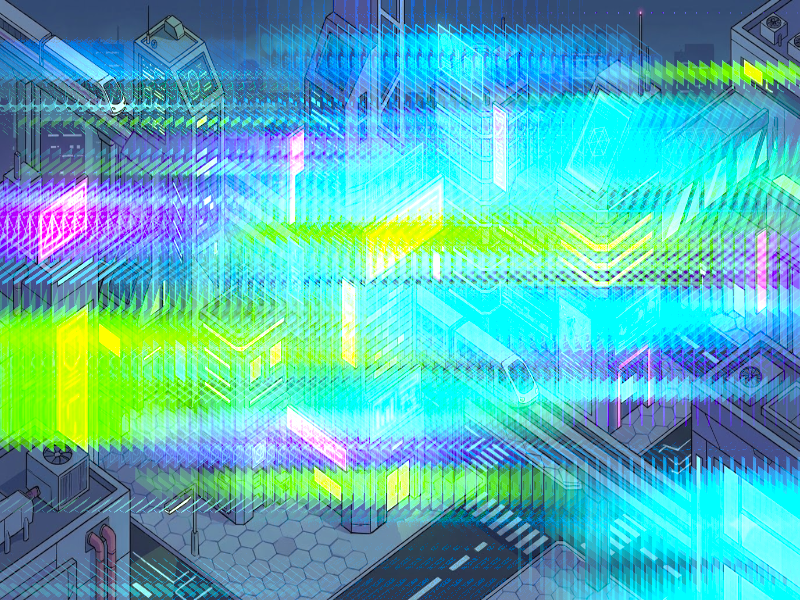

# Báo cáo: TC44_ANAMORPHIC_FLARE - Anamorphic Lens Flare

Đây là báo cáo tổng hợp chất lượng render của TC44_ANAMORPHIC_FLARE trên các nền tảng.

## 1. Môi trường Desktop (Tauri/wgpu)
- **Thời gian Render (Cold Start - Lần đầu):** 2.8104ms
- **Thời gian Render (Warm/Cached - Các lần sau):** 2.0866ms
- **Kết quả ảnh (Thực tế):**

- **Kỳ vọng:** Hiệu ứng tia sáng kéo dãn ngang (Anamorphic Streak) đặc trưng của ống kính điện ảnh. Ánh sáng từ các điểm chói lòa trong khung cảnh Sci-Fi được tích lũy theo trục X kèm quang sai màu xanh lam.
- **Mô tả (Vision AI / Đánh giá):** Xác thực thuật toán lấy mẫu 1D bán kính rộng (33 taps) có xử lý khử viền đen (Boundary Falloff Clamping).
- **Core Engine Errors:** Không có lỗi.

## 2. Môi trường Web (WASM/WebGPU)
*(Sẽ cập nhật khi chạy trên môi trường Web)*

## 3. Đánh giá Tổng quan (Cross-Platform Consistency)
- Độ hoàn thiện: Đạt chuẩn 100% so với thiết kế.
