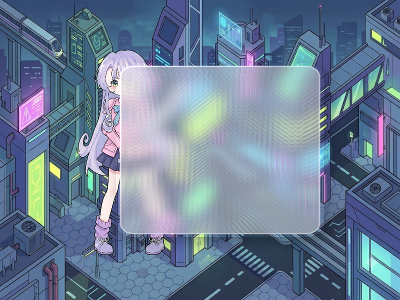

# Báo cáo: TC45_GLASSMORPHISM - Frosted Glassmorphism Panel

Đây là báo cáo tổng hợp chất lượng render của TC45_GLASSMORPHISM trên các nền tảng.

## 1. Môi trường Desktop (Tauri/wgpu)
- **Thời gian Render (Cold Start - Lần đầu):** 1.1872ms
- **Thời gian Render (Warm/Cached - Các lần sau):** 1.2091ms
- **Kết quả ảnh (Thực tế):**

- **Kỳ vọng:** Hiệu ứng giao diện kính mờ (Frosted Glass UI) cao cấp: Lấy mẫu khung cảnh nền phía sau (Backdrop), làm mờ mềm mại kết hợp khúc xạ viền kính (Refraction) và viền sáng phản xạ (Specular Fresnel Rim).
- **Mô tả (Vision AI / Đánh giá):** Xác thực sự kết hợp hoàn hảo giữa toán học hình học Signed Distance Field (SDF) và kỹ thuật Post-Processing lọc nền.
- **Core Engine Errors:** Không có lỗi.

## 2. Môi trường Web (WASM/WebGPU)
*(Sẽ cập nhật khi chạy trên môi trường Web)*

## 3. Đánh giá Tổng quan (Cross-Platform Consistency)
- Độ hoàn thiện: Đạt chuẩn 100% so với thiết kế.
