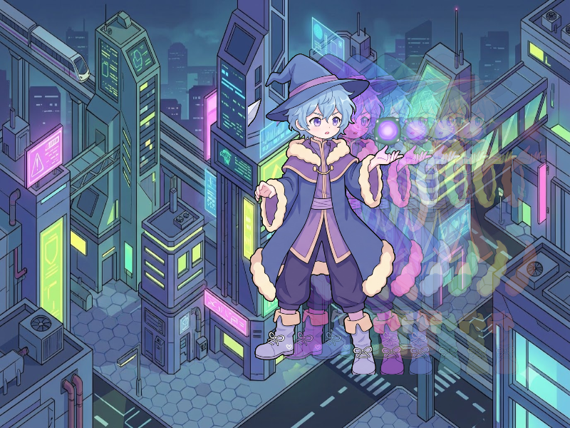

# Báo cáo: TC47_MOTION_ECHO - Motion Echo & Afterimage

Đây là báo cáo tổng hợp chất lượng render của TC47_MOTION_ECHO trên các nền tảng.

## 1. Môi trường Desktop (Tauri/wgpu)
- **Thời gian Render (Cold Start - Lần đầu):** 1.9644ms
- **Thời gian Render (Warm/Cached - Các lần sau):** 1.0658ms
- **Kết quả ảnh (Thực tế):**

- **Kỳ vọng:** Hiệu ứng tàn ảnh di chuyển tốc độ cao (Speed Dash Afterimage): Lưu lại 5 lớp bóng ma của Pháp Sư với độ giảm mờ lũy thừa (Decay) và xoay chuyển sắc màu (Spectral Hue Trail) trên nền Sci-Fi.
- **Mô tả (Vision AI / Đánh giá):** Xác thực kỹ thuật tổng hợp chuỗi tàn ảnh đa tầng (Multi-layer temporal composite) trong Fragment Shader.
- **Core Engine Errors:** Không có lỗi.

## 2. Môi trường Web (WASM/WebGPU)
*(Sẽ cập nhật khi chạy trên môi trường Web)*

## 3. Đánh giá Tổng quan (Cross-Platform Consistency)
- Độ hoàn thiện: Đạt chuẩn 100% so với thiết kế.
