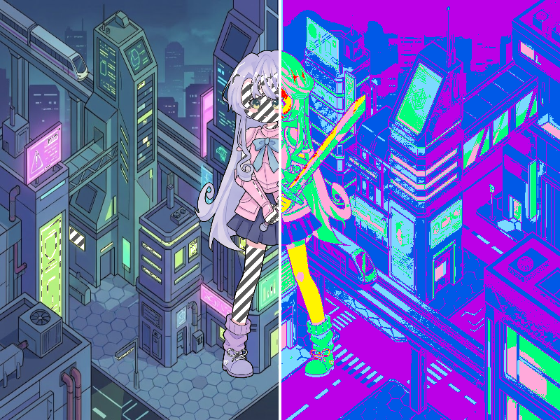

# Báo cáo: TC50 - Overlay kiểm tra phơi sáng

Đây là báo cáo kiểm thử hai môi trường dùng chung manifest và hợp đồng graph.

## 1. Mô tả và graph dùng chung

- **Manifest:** `C:/Users/abc/.AI/Code/ifol-animation/crates/ifol-gpu/tests/shared_assets/manifests/tc50_exposure_inspector.json`
- **Graph fingerprint (FNV-1a):** `6eb21c3021072252`
- **Mô tả test case:** Render scene canonical rồi chia thành vùng zebra và false-color để kiểm tra phơi sáng.
- **Target:** `800x600`, `Rgba8UnormSrgb`
- **Shader/WGSL:** `chroma_key_cropped.wgsl`, `exposure_inspector.wgsl`, `texture_blit.wgsl`
- **Asset/input:** `canonical_bg_scifi.png`, `canonical_sprites_heroes.png`
- **Chính sách input:** Desktop và WebGPU dùng các texture PNG canonical; không dùng decoder JPEG trong phép đo parity.
- **Depth/stencil:** `Không áp dụng`
- **Chuỗi pass:** scene_pass (Canonical scene, target scene) → inspector_pass (Zebra and false color, target final)
- **Số pass:** `2`
- **Độ sâu graph:** `KHÔNG ÁP DỤNG`
- **Hierarchy:** `Không khai báo`
- **Thứ tự operation sau flatten:** `scene_background → scene_paladin → exposure_overlay`
- **Sampler contract:** `{"address_mode_u": "repeat", "address_mode_v": "repeat", "address_mode_w": "repeat", "mag_filter": "linear", "min_filter": "linear", "mipmap_filter": "linear"}`
- **Thứ tự layer kỳ vọng:** `scene_pass → inspector_pass`
- **Graph resources:** nodes=`2`, draw commands=`3`, tổng instances=`3`, procedural particles=`Không khai báo`
- **Node pool contract:** `Không áp dụng`
- **Error/fallback contract:** `Không áp dụng`
- **Desktop/Web dùng cùng manifest fingerprint:** `ĐẠT`

## 2. Môi trường Desktop

- **Thời gian render lần đầu (cold):** `4.4809 ms`
- **Thời gian render lần hai (warm/cache):** `1.3625 ms`
- **Số lần warm được đo:** `1`
- **Output cold và warm giống nhau:** `True`
- **Speedup cold → warm:** `69.6%`
- **Adapter/backend:** `Intel(R) Iris(R) Xe Graphics` / `Vulkan`
- **Phạm vi timing:** `2 pass scene composition → exposure inspector + submit queue + device.poll(Wait); không gồm khởi tạo device/pipeline và readback`
- **Phạm vi cô lập/cache:** `DesktopTestHarness mới cho từng TC; không xóa cache nội bộ của driver/GPU`
- **Dữ liệu raw:** `C:/Users/abc/.AI/Code/ifol-animation/crates/ifol-gpu/tests/outputs/desktop/tc50_exposure_inspector_desktop.bin`
- **Dấu vân tay raw (FNV-1a):** `1f754efbde80a383`
- **SHA-256:** `8e68f8faf2c0c37e8b2c4f9bef21fa9c0f8b1f5eb6085c047422e701c87bc102`
- **Ảnh:** 
- **Đánh giá nội dung:** `ĐẠT`
- **Đánh giá bằng vision:** Desktop/Web đều hiển thị cùng scene Sci-Fi và paladin; nửa trái là zebra trên vùng sáng, nửa phải là false-color IRE với vạch chia trắng; bố cục trùng nhau.
- **Graph thực tế:** nodes=2, draw commands=3, instances=3

## 3. Môi trường WebGPU

- **Thời gian render lần đầu (cold):** `245.4000 ms`
- **Thời gian render lần hai (warm/cache):** `3.7000 ms`
- **Số lần warm được đo:** `1`
- **Output cold và warm giống nhau:** `True`
- **Speedup cold → warm:** `98.5%`
- **Adapter:** `gen-12lp`
- **Phạm vi timing:** `2 pass scene composition → exposure inspector + submit queue + onSubmittedWorkDone; không gồm khởi tạo device/pipeline và readback`
- **Phạm vi cô lập/cache:** `Resource của TC được hủy sau khi hoàn tất; không xóa cache nội bộ của browser/driver/GPU`
- **Dữ liệu raw:** `C:/Users/abc/.AI/Code/ifol-animation/crates/ifol-gpu/tests/outputs/web/tc50_exposure_inspector_web.bin`
- **Dấu vân tay raw (FNV-1a):** `db459e58147dc723`
- **SHA-256:** `72436dd22efbb93096fb87af0346b19bc0f668a29faaa0cc9209c4a103e334c1`
- **Ảnh:** 
- **Đánh giá nội dung:** `ĐẠT`
- **Đánh giá bằng vision:** Desktop/Web đều hiển thị cùng scene Sci-Fi và paladin; nửa trái là zebra trên vùng sáng, nửa phải là false-color IRE với vạch chia trắng; bố cục trùng nhau.
- **Graph thực tế:** nodes=2, draw commands=3, instances=3

## 4. So sánh và kết luận

| Tiêu chí | Kết quả |
| --- | --- |
| Graph/manifest giống nhau | `ĐẠT` |
| Kích thước dữ liệu raw giống nhau | `ĐẠT` |
| Byte raw giống tuyệt đối | `KHÔNG ĐẠT` |
| Số byte khác nhau | `96` |
| Số pixel khác nhau | `32` |
| Sai số kênh màu lớn nhất | `166/255` |
| Khác biệt màu/presentation | `CÓ - cần theo dõi để đạt byte parity` |
| Số pixel non-background Desktop/Web | `KHÔNG ÁP DỤNG` |
| Bounding box Desktop | `KHÔNG ÁP DỤNG` |
| Bounding box WebGPU | `KHÔNG ÁP DỤNG` |
| Bounding box non-background giống nhau | `ĐẠT` |
| Số pixel mask khác nhau | `0` (ngưỡng `0`) |
| Parity cấu trúc không phụ thuộc màu | `ĐẠT` |
| Cache giữ nguyên output cold/warm ở cả hai môi trường | `ĐẠT` |
| Validation/fallback contract không panic | `ĐẠT` |
| Đúng mô tả test case | `ĐẠT` |

**Kết luận:** `ĐẠT CÓ ĐIỀU KIỆN - graph và cấu trúc render giống; khác biệt còn lại thuộc pixel/màu và nằm trong ngưỡng đã khai báo.`

## 5. Phân tích hiệu suất

Các giá trị trên đo thời gian thực thi graph, submit lệnh và chờ GPU hoàn tất;
không bao gồm khởi tạo device/pipeline hoặc readback. Vì vậy `cold` ở đây là
lần execute đầu sau khi resource/pipeline đã được tạo, không phải cold start
của toàn bộ ứng dụng. Giá trị dưới `1 ms` tương đương microsecond và cần được
đọc theo đơn vị đó khi phân tích.
