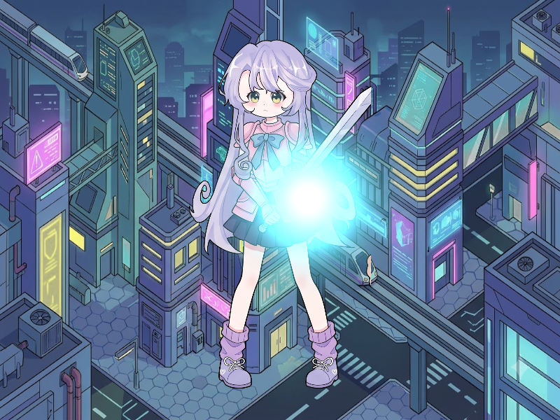

# Báo cáo: TC52 - Hạt mềm theo depth

Đây là báo cáo kiểm thử hai môi trường dùng chung manifest và hợp đồng graph.

## 1. Mô tả và graph dùng chung

- **Manifest:** `C:/Users/abc/.AI/Code/ifol-animation/crates/ifol-gpu/tests/shared_assets/manifests/tc52_soft_particles.json`
- **Graph fingerprint (FNV-1a):** `3f930de62616d52f`
- **Mô tả test case:** Render scene paladin có depth test cùng quả cầu năng lượng volumetric hòa trộn additive.
- **Target:** `800x600`, `Rgba8UnormSrgb`
- **Shader/WGSL:** `chroma_key_cropped.wgsl`, `soft_particle.wgsl`
- **Asset/input:** `canonical_bg_scifi.png`, `canonical_sprites_heroes.png`
- **Chính sách input:** Desktop và WebGPU dùng các texture PNG canonical; particle là dữ liệu uniform deterministic.
- **Depth/stencil:** `{"format": "Depth32Float", "clear": 1.0, "write": true, "compare": "LessEqual"}`
- **Chuỗi pass:** soft_particle_pass (Depth-tested sprites and additive particle, target final)
- **Số pass:** `1`
- **Độ sâu graph:** `KHÔNG ÁP DỤNG`
- **Hierarchy:** `Không khai báo`
- **Thứ tự operation sau flatten:** `soft_background → soft_paladin → energy_sphere`
- **Sampler contract:** `{"address_mode_u": "repeat", "address_mode_v": "repeat", "address_mode_w": "repeat", "mag_filter": "linear", "min_filter": "linear", "mipmap_filter": "linear"}`
- **Thứ tự layer kỳ vọng:** `soft_particle_pass`
- **Graph resources:** nodes=`1`, draw commands=`3`, tổng instances=`3`, procedural particles=`Không khai báo`
- **Node pool contract:** `Không áp dụng`
- **Error/fallback contract:** `Không áp dụng`
- **Desktop/Web dùng cùng manifest fingerprint:** `ĐẠT`

## 2. Môi trường Desktop

- **Thời gian render lần đầu (cold):** `4.2867 ms`
- **Thời gian render lần hai (warm/cache):** `1.2067 ms`
- **Số lần warm được đo:** `1`
- **Output cold và warm giống nhau:** `True`
- **Speedup cold → warm:** `71.9%`
- **Adapter/backend:** `Intel(R) Iris(R) Xe Graphics` / `Vulkan`
- **Phạm vi timing:** `1 pass depth-tested sprites + additive particle + submit queue + device.poll(Wait); không gồm khởi tạo device/pipeline và readback`
- **Phạm vi cô lập/cache:** `DesktopTestHarness mới cho từng TC; không xóa cache nội bộ của driver/GPU`
- **Dữ liệu raw:** `C:/Users/abc/.AI/Code/ifol-animation/crates/ifol-gpu/tests/outputs/desktop/tc52_soft_particles_desktop.bin`
- **Dấu vân tay raw (FNV-1a):** `48dd253f222e5f35`
- **SHA-256:** `5b582a592a3c15f3a72e9b9bf68a22ab92a6345bd6f433e5591bf3ed2e030390`
- **Ảnh:** 
- **Đánh giá nội dung:** `ĐẠT`
- **Đánh giá bằng vision:** Desktop/Web cùng hiển thị paladin trên nền Sci-Fi với quả cầu plasma cyan phát sáng ở vùng thân; depth và additive blend đúng mô tả, khác biệt chỉ ở vùng glow.
- **Graph thực tế:** nodes=1, draw commands=3, instances=3

## 3. Môi trường WebGPU

- **Thời gian render lần đầu (cold):** `23.6000 ms`
- **Thời gian render lần hai (warm/cache):** `3.2000 ms`
- **Số lần warm được đo:** `1`
- **Output cold và warm giống nhau:** `True`
- **Speedup cold → warm:** `86.4%`
- **Adapter:** `gen-12lp`
- **Phạm vi timing:** `1 pass depth-tested sprites + additive particle + submit queue + onSubmittedWorkDone; không gồm khởi tạo device/pipeline và readback`
- **Phạm vi cô lập/cache:** `Resource của TC được hủy sau khi hoàn tất; không xóa cache nội bộ của browser/driver/GPU`
- **Dữ liệu raw:** `C:/Users/abc/.AI/Code/ifol-animation/crates/ifol-gpu/tests/outputs/web/tc52_soft_particles_web.bin`
- **Dấu vân tay raw (FNV-1a):** `ae746ef88d72adb6`
- **SHA-256:** `929268d4625042b3966945e4ad0035f5a25ed4113bbb6c6ca0400194d842511a`
- **Ảnh:** 
- **Đánh giá nội dung:** `ĐẠT`
- **Đánh giá bằng vision:** Desktop/Web cùng hiển thị paladin trên nền Sci-Fi với quả cầu plasma cyan phát sáng ở vùng thân; depth và additive blend đúng mô tả, khác biệt chỉ ở vùng glow.
- **Graph thực tế:** nodes=1, draw commands=3, instances=3

## 4. So sánh và kết luận

| Tiêu chí | Kết quả |
| --- | --- |
| Graph/manifest giống nhau | `ĐẠT` |
| Kích thước dữ liệu raw giống nhau | `ĐẠT` |
| Byte raw giống tuyệt đối | `KHÔNG ĐẠT` |
| Số byte khác nhau | `4495` |
| Số pixel khác nhau | `1554` |
| Sai số kênh màu lớn nhất | `101/255` |
| Khác biệt màu/presentation | `CÓ - cần theo dõi để đạt byte parity` |
| Số pixel non-background Desktop/Web | `KHÔNG ÁP DỤNG` |
| Bounding box Desktop | `KHÔNG ÁP DỤNG` |
| Bounding box WebGPU | `KHÔNG ÁP DỤNG` |
| Bounding box non-background giống nhau | `ĐẠT` |
| Số pixel mask khác nhau | `0` (ngưỡng `0`) |
| Parity cấu trúc không phụ thuộc màu | `ĐẠT` |
| Cache giữ nguyên output cold/warm ở cả hai môi trường | `ĐẠT` |
| Validation/fallback contract không panic | `ĐẠT` |
| Đúng mô tả test case | `ĐẠT` |

**Kết luận:** `ĐẠT CÓ ĐIỀU KIỆN - graph và cấu trúc render giống; khác biệt còn lại thuộc pixel/màu và nằm trong ngưỡng đã khai báo.`

## 5. Phân tích hiệu suất

Các giá trị trên đo thời gian thực thi graph, submit lệnh và chờ GPU hoàn tất;
không bao gồm khởi tạo device/pipeline hoặc readback. Vì vậy `cold` ở đây là
lần execute đầu sau khi resource/pipeline đã được tạo, không phải cold start
của toàn bộ ứng dụng. Giá trị dưới `1 ms` tương đương microsecond và cần được
đọc theo đơn vị đó khi phân tích.
