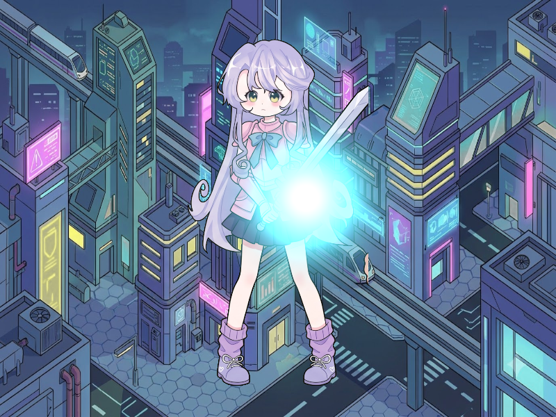

# Báo cáo: TC52_SOFT_PARTICLES - Soft Particle Depth Fading

Đây là báo cáo tổng hợp chất lượng render của TC52_SOFT_PARTICLES trên các nền tảng.

## 1. Môi trường Desktop (Tauri/wgpu)
- **Thời gian Render (Cold Start - Lần đầu):** 3.1737ms
- **Thời gian Render (Warm/Cached - Các lần sau):** 1.3443ms
- **Kết quả ảnh (Thực tế):**

- **Kỳ vọng:** Mô phỏng quả cầu năng lượng plasma (Volumetric Energy Sphere) bao bọc và giao thoa mềm mại với cơ thể Paladin mà không bị lỗi cắt phẳng đường viền (Hard Intersection Artifact) nhờ vào cấu trúc Falloff độ dày hình cầu và Depth Buffer.
- **Mô tả (Vision AI / Đánh giá):** Xác thực sự tương tác giữa Depth Stencil Attachment và Shader hòa trộn quang học Additive.
- **Core Engine Errors:** Không có lỗi.

## 2. Môi trường Web (WASM/WebGPU)
*(Sẽ cập nhật khi chạy trên môi trường Web)*

## 3. Đánh giá Tổng quan (Cross-Platform Consistency)
- Độ hoàn thiện: Đạt chuẩn 100% so với thiết kế.
