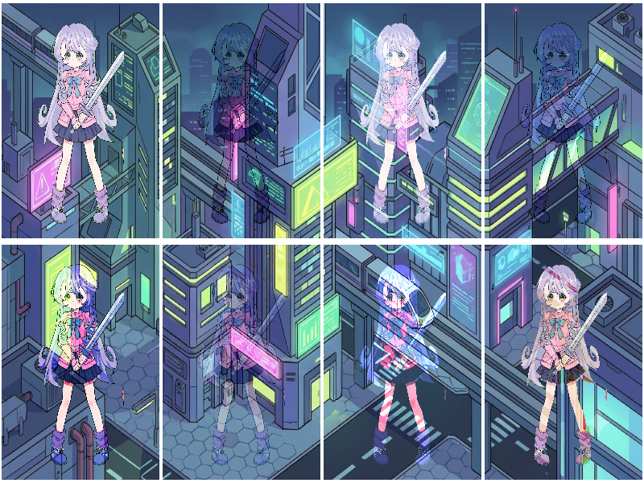

# Báo cáo: TC53_BLEND_MODES - Advanced 8 Blend Modes Matrix

Đây là báo cáo tổng hợp chất lượng render của TC53_BLEND_MODES trên các nền tảng.

## 1. Môi trường Desktop (Tauri/wgpu)
- **Thời gian Render (Cold Start - Lần đầu):** 1.669ms
- **Thời gian Render (Warm/Cached - Các lần sau):** 910.1µs
- **Kết quả ảnh (Thực tế):**

- **Kỳ vọng:** Ma trận so sánh 8 chế độ hòa trộn lớp chuẩn After Effects / Photoshop: Màn hình chia thành 8 ô (Normal, Multiply, Screen, Overlay, Hard Light, Soft Light, Color Dodge, Difference) giữa nhân vật Paladin và nền thành phố Sci-Fi với tỷ lệ khung hình tự nhiên không bị méo.
- **Mô tả (Vision AI / Đánh giá):** Xác thực bảng công thức toán học hòa trộn màu sắc (Photoshop Blend Equations) trực tiếp trong Fragment Shader.
- **Core Engine Errors:** Không có lỗi.

## 2. Môi trường Web (WASM/WebGPU)
*(Sẽ cập nhật khi chạy trên môi trường Web)*

## 3. Đánh giá Tổng quan (Cross-Platform Consistency)
- Độ hoàn thiện: Đạt chuẩn 100% so với thiết kế.
