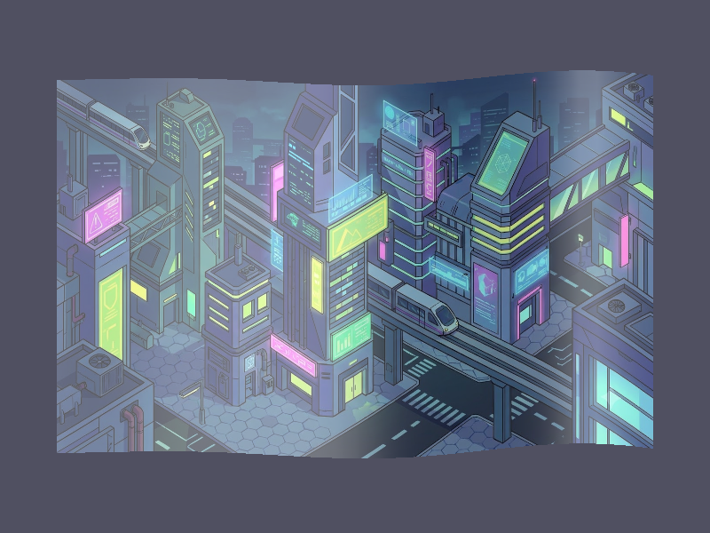

# Báo cáo: TC54 - Lưới cờ 3D uốn theo sóng

Đây là báo cáo kiểm thử hai môi trường dùng chung manifest và hợp đồng graph.

## 1. Mô tả và graph dùng chung

- **Manifest:** `../shared_assets/manifests/tc54_flag_mesh.json`
- **Graph fingerprint (FNV-1a):** `99296555552df541`
- **Mô tả test case:** Render lưới cờ indexed 32x32 với biến dạng đỉnh và chiếu sáng Phong deterministic.
- **Target:** `800x600`, `Rgba8UnormSrgb`
- **Shader/WGSL:** `flag_mesh.wgsl`
- **Asset/input:** `canonical_bg_scifi.png`
- **Chính sách input:** Desktop và WebGPU dùng nền PNG canonical; mesh vertex/index và uniform được tạo cùng thông số.
- **Depth/stencil:** `Không áp dụng`
- **Chuỗi pass:** flag_pass (Indexed flag mesh, target final)
- **Số pass:** `1`
- **Độ sâu graph:** `KHÔNG ÁP DỤNG`
- **Hierarchy:** `Không khai báo`
- **Thứ tự operation sau flatten:** `flag_mesh`
- **Sampler contract:** `{"address_mode_u": "clamp-to-edge", "address_mode_v": "clamp-to-edge", "address_mode_w": "clamp-to-edge", "mag_filter": "linear", "min_filter": "linear", "mipmap_filter": "linear"}`
- **Thứ tự layer kỳ vọng:** `flag_pass`
- **Graph resources:** nodes=`1`, draw commands=`1`, tổng instances=`1`, procedural particles=`Không khai báo`
- **Node pool contract:** `Không áp dụng`
- **Error/fallback contract:** `Không áp dụng`
- **Desktop/Web dùng cùng manifest fingerprint:** `ĐẠT`

## 2. Môi trường Desktop

- **Thời gian render lần đầu (cold):** `2.4269 ms`
- **Thời gian render lần hai (warm/cache):** `0.8848 ms (884.8 µs)`
- **Số lần warm được đo:** `1`
- **Output cold và warm giống nhau:** `True`
- **Speedup cold → warm:** `63.5%`
- **Adapter/backend:** `Intel(R) Iris(R) Xe Graphics` / `Vulkan`
- **Phạm vi timing:** `1 pass indexed 32x32 mesh + submit queue + device.poll(Wait); không gồm khởi tạo device/pipeline và readback`
- **Phạm vi cô lập/cache:** `DesktopTestHarness mới cho từng TC; không xóa cache nội bộ của driver/GPU`
- **Dữ liệu raw:** `../outputs/desktop/tc54_flag_mesh_desktop.bin`
- **Dấu vân tay raw (FNV-1a):** `a42bb268b33d1d1c`
- **SHA-256:** `7fa29c0bcdf65aff817ef706850f2c231c038f1d3d1caf1db7c8f90b37397071`
- **Ảnh:** 
- **Đánh giá nội dung:** `ĐẠT`
- **Đánh giá bằng vision:** Desktop hiển thị nền Sci-Fi qua lưới indexed 32x32 có biến dạng sóng và chiếu sáng; vùng mesh đầy đủ, không bị mất index hoặc validation error.
- **Graph thực tế:** nodes=1, draw commands=1, instances=1

## 3. Môi trường WebGPU

- **Thời gian render lần đầu (cold):** `41.7000 ms`
- **Thời gian render lần hai (warm/cache):** `3.1000 ms`
- **Số lần warm được đo:** `1`
- **Output cold và warm giống nhau:** `True`
- **Speedup cold → warm:** `92.6%`
- **Adapter:** `gen-12lp`
- **Phạm vi timing:** `1 pass indexed 32x32 mesh + submit queue + onSubmittedWorkDone; không gồm khởi tạo device/pipeline và readback`
- **Phạm vi cô lập/cache:** `Resource của TC được hủy sau khi hoàn tất; không xóa cache nội bộ của browser/driver/GPU`
- **Dữ liệu raw:** `../outputs/web/tc54_flag_mesh_web.bin`
- **Dấu vân tay raw (FNV-1a):** `e0c43ffd611cc623`
- **SHA-256:** `3aa288b175147b2904c8ac55a4158f369bfc1db2e50b31d0306034a6dcb3d518`
- **Ảnh:** 
- **Đánh giá nội dung:** `ĐẠT`
- **Đánh giá bằng vision:** WebGPU hiển thị cùng nền Sci-Fi và vùng lưới biến dạng/chiếu sáng; bố cục, vùng phủ và hình ảnh khớp Desktop, không có validation error.
- **Graph thực tế:** nodes=1, draw commands=1, instances=1

## 4. So sánh và kết luận

| Tiêu chí | Kết quả |
| --- | --- |
| Graph/manifest giống nhau | `ĐẠT` |
| Kích thước dữ liệu raw giống nhau | `ĐẠT` |
| Byte raw giống tuyệt đối | `KHÔNG ĐẠT` |
| Số byte khác nhau | `976` |
| Số pixel khác nhau | `350` |
| Sai số kênh màu lớn nhất | `71/255` |
| Khác biệt màu/presentation | `CÓ - cần theo dõi để đạt byte parity` |
| Số pixel non-background Desktop/Web | `KHÔNG ÁP DỤNG` |
| Bounding box Desktop | `KHÔNG ÁP DỤNG` |
| Bounding box WebGPU | `KHÔNG ÁP DỤNG` |
| Bounding box non-background giống nhau | `ĐẠT` |
| Số pixel mask khác nhau | `0` (ngưỡng `0`) |
| Parity cấu trúc không phụ thuộc màu | `ĐẠT` |
| Cache giữ nguyên output cold/warm ở cả hai môi trường | `ĐẠT` |
| Validation/fallback contract không panic | `ĐẠT` |
| Đúng mô tả test case | `ĐẠT` |

**Kết luận:** `ĐẠT CÓ ĐIỀU KIỆN - graph và cấu trúc render giống; khác biệt còn lại thuộc pixel/màu và nằm trong ngưỡng đã khai báo.`

## 5. Phân tích hiệu suất

Các giá trị trên đo thời gian thực thi graph, submit lệnh và chờ GPU hoàn tất;
không bao gồm khởi tạo device/pipeline hoặc readback. Vì vậy `cold` ở đây là
lần execute đầu sau khi resource/pipeline đã được tạo, không phải cold start
của toàn bộ ứng dụng. Giá trị dưới `1 ms` tương đương microsecond và cần được
đọc theo đơn vị đó khi phân tích.
