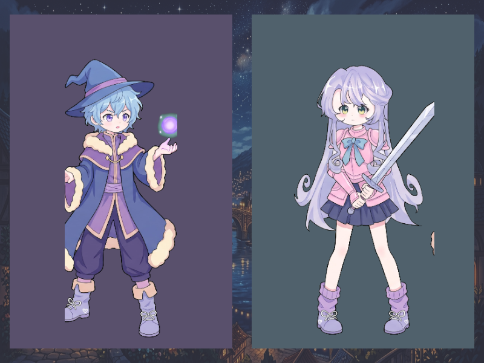

# Báo cáo: TC56 - Thay đổi kích thước RenderTarget động

Đây là báo cáo kiểm thử hai môi trường dùng chung manifest và hợp đồng graph.

## 1. Mô tả và graph dùng chung

- **Manifest:** `../shared_assets/manifests/tc56_dynamic_resize.json`
- **Graph fingerprint (FNV-1a):** `712b3ac12833ff81`
- **Mô tả test case:** Render hai target dọc 400x600 rồi tổng hợp vào target cuối 800x600.
- **Target:** `800x600`, `Rgba8UnormSrgb`
- **Shader/WGSL:** `chroma_key_cropped.wgsl`, `sprite_blit.wgsl`
- **Asset/input:** `canonical_bg_anime_city.png`, `canonical_sprites_heroes.png`
- **Chính sách input:** Desktop và WebGPU dùng cùng PNG canonical anime city và heroes; các target và crop được lấy trực tiếp từ manifest.
- **Depth/stencil:** `Không áp dụng`
- **Chuỗi pass:** left_pass (400x600 left portrait, target left) → right_pass (400x600 right portrait, target right) → final_pass (800x600 viewport composition, target final)
- **Số pass:** `3`
- **Độ sâu graph:** `KHÔNG ÁP DỤNG`
- **Hierarchy:** `Không khai báo`
- **Thứ tự operation sau flatten:** `resize_left_wizard → resize_right_paladin → resize_background → resize_left_panel → resize_right_panel`
- **Sampler contract:** `{"address_mode_u": "clamp-to-edge", "address_mode_v": "clamp-to-edge", "address_mode_w": "clamp-to-edge", "mag_filter": "linear", "min_filter": "linear", "mipmap_filter": "linear"}`
- **Thứ tự layer kỳ vọng:** `left_pass → right_pass → final_pass`
- **Graph resources:** nodes=`3`, draw commands=`5`, tổng instances=`5`, procedural particles=`Không khai báo`
- **Node pool contract:** `Không áp dụng`
- **Error/fallback contract:** `Không áp dụng`
- **Desktop/Web dùng cùng manifest fingerprint:** `ĐẠT`

## 2. Môi trường Desktop

- **Thời gian render lần đầu (cold):** `7.6580 ms`
- **Thời gian render lần hai (warm/cache):** `1.7432 ms`
- **Số lần warm được đo:** `1`
- **Output cold và warm giống nhau:** `True`
- **Speedup cold → warm:** `77.2%`
- **Adapter/backend:** `Intel(R) Iris(R) Xe Graphics` / `Vulkan`
- **Phạm vi timing:** `3 pass 400x600 left/right targets → 800x600 composition + submit queue + device.poll(Wait); không gồm khởi tạo device/pipeline và readback`
- **Phạm vi cô lập/cache:** `DesktopTestHarness mới cho từng TC; không xóa cache nội bộ của driver/GPU`
- **Dữ liệu raw:** `../outputs/desktop/tc56_dynamic_resize_desktop.bin`
- **Dấu vân tay raw (FNV-1a):** `88d0377223d0f378`
- **SHA-256:** `f5a43d7b9a55b016cccf43ca97c101f4d620a0df1770f2c9f8f4d91a10d4644f`
- **Ảnh:** 
- **Đánh giá nội dung:** `ĐẠT`
- **Đánh giá bằng vision:** Desktop hiển thị hai panel dọc 400x600 với wizard bên trái và paladin bên phải trên nền anime city; tỷ lệ và bố cục đúng, không mất target.
- **Graph thực tế:** nodes=3, draw commands=5, instances=5

## 3. Môi trường WebGPU

- **Thời gian render lần đầu (cold):** `12.6000 ms`
- **Thời gian render lần hai (warm/cache):** `3.6000 ms`
- **Số lần warm được đo:** `1`
- **Output cold và warm giống nhau:** `True`
- **Speedup cold → warm:** `71.4%`
- **Adapter:** `gen-12lp`
- **Phạm vi timing:** `3 pass 400x600 left/right targets → 800x600 composition + submit queue + onSubmittedWorkDone; không gồm khởi tạo device/pipeline và readback`
- **Phạm vi cô lập/cache:** `Resource của TC được hủy sau khi hoàn tất; không xóa cache nội bộ của browser/driver/GPU`
- **Dữ liệu raw:** `../outputs/web/tc56_dynamic_resize_web.bin`
- **Dấu vân tay raw (FNV-1a):** `a7386d3e8d793125`
- **SHA-256:** `ea11f3e44367865630043e1f9c3acf16b7c8748ccd4b9eff11e2962be69fd283`
- **Ảnh:** 
- **Đánh giá nội dung:** `ĐẠT`
- **Đánh giá bằng vision:** WebGPU hiển thị cùng hai panel dọc, cùng nhân vật, nền và tỷ lệ; khác biệt chỉ ở biên rasterization nhỏ, không có lỗi cấu trúc.
- **Graph thực tế:** nodes=3, draw commands=5, instances=5

## 4. So sánh và kết luận

| Tiêu chí | Kết quả |
| --- | --- |
| Graph/manifest giống nhau | `ĐẠT` |
| Kích thước dữ liệu raw giống nhau | `ĐẠT` |
| Byte raw giống tuyệt đối | `KHÔNG ĐẠT` |
| Số byte khác nhau | `5200` |
| Số pixel khác nhau | `1979` |
| Sai số kênh màu lớn nhất | `37/255` |
| Khác biệt màu/presentation | `CÓ - cần theo dõi để đạt byte parity` |
| Số pixel non-background Desktop/Web | `KHÔNG ÁP DỤNG` |
| Bounding box Desktop | `KHÔNG ÁP DỤNG` |
| Bounding box WebGPU | `KHÔNG ÁP DỤNG` |
| Bounding box non-background giống nhau | `ĐẠT` |
| Số pixel mask khác nhau | `0` (ngưỡng `0`) |
| Parity cấu trúc không phụ thuộc màu | `ĐẠT` |
| Cache giữ nguyên output cold/warm ở cả hai môi trường | `ĐẠT` |
| Validation/fallback contract không panic | `ĐẠT` |
| Đúng mô tả test case | `ĐẠT` |

**Kết luận:** `ĐẠT CÓ ĐIỀU KIỆN - graph và cấu trúc render giống; khác biệt còn lại thuộc pixel/màu và nằm trong ngưỡng đã khai báo.`

## 5. Phân tích hiệu suất

Các giá trị trên đo thời gian thực thi graph, submit lệnh và chờ GPU hoàn tất;
không bao gồm khởi tạo device/pipeline hoặc readback. Vì vậy `cold` ở đây là
lần execute đầu sau khi resource/pipeline đã được tạo, không phải cold start
của toàn bộ ứng dụng. Giá trị dưới `1 ms` tương đương microsecond và cần được
đọc theo đơn vị đó khi phân tích.
