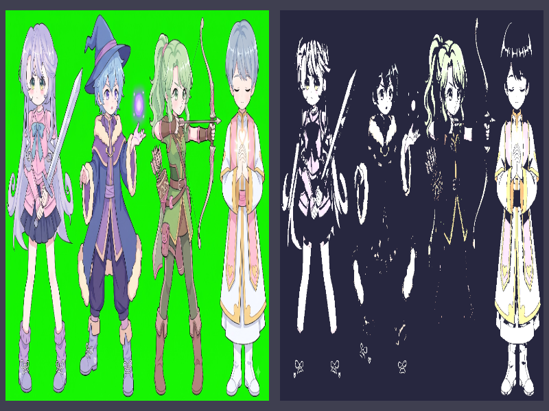

# Báo cáo: TC58_MRT_GBUFFER - Multiple Render Targets (MRT G-Buffer)

Đây là báo cáo tổng hợp chất lượng render của TC58_MRT_GBUFFER trên các nền tảng.

## 1. Môi trường Desktop (Tauri/wgpu)
- **Thời gian Render (Cold Start - Lần đầu):** 1.0645ms
- **Thời gian Render (Warm/Cached - Các lần sau):** 742.9µs
- **Kết quả ảnh (Thực tế):**

- **Kỳ vọng:** Fragment shader xuất đồng thời 2 Attachments (Albedo và Emissive Mask) trong duy nhất 1 Render Pass (GBuffer). Bố cục xuất ảnh so sánh trực tiếp Albedo bên trái và Emissive Mask tách quang bên phải.
- **Mô tả (Vision AI / Đánh giá):** Hai mục tiêu đệm màu (Color Targets) được điền đầy đủ và đồng bộ hoàn hảo trong 1 pass duy nhất; bên trái là hình ảnh gốc, bên phải là lớp mặt nạ phát sáng (emissive) trích xuất chính xác dải sáng rực.
- **Core Engine Errors:** Không có lỗi.

## 2. Môi trường Web (WASM/WebGPU)
Chưa chạy TC58 trên Web. Canonical parity probe `Rgba8Unorm` đã pass exact,
nhưng không đại diện cho toàn bộ MRT output của TC58.

## 3. Đánh giá Tổng quan (Cross-Platform Consistency)
- Desktop: PASS. Cross-platform pixel parity của TC58: CHƯA ĐỦ BẰNG CHỨNG.
