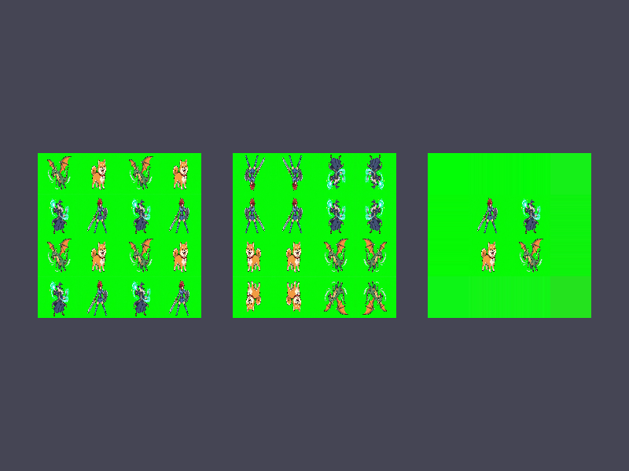

# Báo cáo: TC59 - Ba chế độ quấn texture

Đây là báo cáo kiểm thử hai môi trường dùng chung manifest và hợp đồng graph.

## 1. Mô tả và graph dùng chung

- **Manifest:** `../shared_assets/manifests/tc59_sampler_modes.json`
- **Graph fingerprint (FNV-1a):** `41c657787fe74841`
- **Mô tả test case:** Render cùng một crop có UV vượt [0,1] bằng ba sampler Repeat, MirrorRepeat và ClampToEdge.
- **Target:** `800x600`, `Rgba8UnormSrgb`
- **Shader/WGSL:** `sampler_modes.wgsl`
- **Asset/input:** `props_characters.jpg`
- **Chính sách input:** Desktop và WebGPU dùng cùng asset props_characters.jpg, cùng UV [-0.5,1.5] và cùng sampler contract; bộ giải mã ảnh của nền tảng nằm ngoài phạm vi parity byte tuyệt đối.
- **Depth/stencil:** `Không áp dụng`
- **Chuỗi pass:** sampler_pass (Three sampler address modes, target final)
- **Số pass:** `1`
- **Độ sâu graph:** `KHÔNG ÁP DỤNG`
- **Hierarchy:** `Không khai báo`
- **Thứ tự operation sau flatten:** `sampler_repeat → sampler_mirror → sampler_clamp`
- **Sampler contract:** `{"address_mode_u": "repeat/mirror-repeat/clamp-to-edge", "address_mode_v": "repeat/mirror-repeat/clamp-to-edge", "address_mode_w": "clamp-to-edge", "mag_filter": "linear", "min_filter": "linear", "mipmap_filter": "nearest"}`
- **Thứ tự layer kỳ vọng:** `sampler_pass`
- **Graph resources:** nodes=`1`, draw commands=`3`, tổng instances=`3`, procedural particles=`Không khai báo`
- **Node pool contract:** `Không áp dụng`
- **Error/fallback contract:** `Không áp dụng`
- **Desktop/Web dùng cùng manifest fingerprint:** `ĐẠT`

## 2. Môi trường Desktop

- **Thời gian render lần đầu (cold):** `2.2223 ms`
- **Thời gian render lần hai (warm/cache):** `0.8444 ms (844.4 µs)`
- **Số lần warm được đo:** `1`
- **Output cold và warm giống nhau:** `True`
- **Speedup cold → warm:** `62.0%`
- **Adapter/backend:** `Intel(R) Iris(R) Xe Graphics` / `Vulkan`
- **Phạm vi timing:** `1 pass, 3 sampler address modes + submit queue + device.poll(Wait); không gồm khởi tạo device/pipeline và readback`
- **Phạm vi cô lập/cache:** `DesktopTestHarness mới cho từng TC; không xóa cache nội bộ của driver/GPU`
- **Dữ liệu raw:** `../outputs/desktop/tc59_sampler_modes_desktop.bin`
- **Dấu vân tay raw (FNV-1a):** `2a44928ba521c9e9`
- **SHA-256:** `084d77bc713593254b2df27ca68f5c29d696d5984f3f792157a9ff76ae7f4665`
- **Ảnh:** 
- **Đánh giá nội dung:** `ĐẠT`
- **Đánh giá bằng vision:** Desktop hiển thị đúng ba panel cùng một texture: panel trái lặp Repeat, panel giữa phản chiếu MirrorRepeat, panel phải kéo dài mép ClampToEdge; bố cục đầy đủ và không mất panel.
- **Graph thực tế:** nodes=1, draw commands=3, instances=3

## 3. Môi trường WebGPU

- **Thời gian render lần đầu (cold):** `224.9000 ms`
- **Thời gian render lần hai (warm/cache):** `3.7000 ms`
- **Số lần warm được đo:** `1`
- **Output cold và warm giống nhau:** `True`
- **Speedup cold → warm:** `98.4%`
- **Adapter:** `gen-12lp`
- **Phạm vi timing:** `1 pass, 3 sampler address modes + submit queue + onSubmittedWorkDone; không gồm khởi tạo device/pipeline và readback`
- **Phạm vi cô lập/cache:** `Resource của TC được hủy sau khi hoàn tất; không xóa cache nội bộ của browser/driver/GPU`
- **Dữ liệu raw:** `../outputs/web/tc59_sampler_modes_web.bin`
- **Dấu vân tay raw (FNV-1a):** `5b9fbbd8122fde56`
- **SHA-256:** `54b23ab093fe6be20976531f1803e750e8ea6d68017366efb9b3c68f294ee673`
- **Ảnh:** 
- **Đánh giá nội dung:** `ĐẠT`
- **Đánh giá bằng vision:** WebGPU hiển thị cùng ba panel, cùng vị trí và cùng quy luật lặp/phản chiếu/kẹp; khác biệt chỉ là rasterization/giải mã JPEG rất nhỏ, không có lỗi cấu trúc.
- **Graph thực tế:** nodes=1, draw commands=3, instances=3

## 4. So sánh và kết luận

| Tiêu chí | Kết quả |
| --- | --- |
| Graph/manifest giống nhau | `ĐẠT` |
| Kích thước dữ liệu raw giống nhau | `ĐẠT` |
| Byte raw giống tuyệt đối | `KHÔNG ĐẠT` |
| Số byte khác nhau | `24752` |
| Số pixel khác nhau | `16675` |
| Sai số kênh màu lớn nhất | `3/255` |
| Khác biệt màu/presentation | `CÓ - cần theo dõi để đạt byte parity` |
| Số pixel non-background Desktop/Web | `KHÔNG ÁP DỤNG` |
| Bounding box Desktop | `KHÔNG ÁP DỤNG` |
| Bounding box WebGPU | `KHÔNG ÁP DỤNG` |
| Bounding box non-background giống nhau | `ĐẠT` |
| Số pixel mask khác nhau | `0` (ngưỡng `0`) |
| Parity cấu trúc không phụ thuộc màu | `ĐẠT` |
| Cache giữ nguyên output cold/warm ở cả hai môi trường | `ĐẠT` |
| Validation/fallback contract không panic | `ĐẠT` |
| Đúng mô tả test case | `ĐẠT` |

**Kết luận:** `ĐẠT CÓ ĐIỀU KIỆN - graph và cấu trúc render giống; khác biệt còn lại thuộc pixel/màu và nằm trong ngưỡng đã khai báo.`

## 5. Phân tích hiệu suất

Các giá trị trên đo thời gian thực thi graph, submit lệnh và chờ GPU hoàn tất;
không bao gồm khởi tạo device/pipeline hoặc readback. Vì vậy `cold` ở đây là
lần execute đầu sau khi resource/pipeline đã được tạo, không phải cold start
của toàn bộ ứng dụng. Giá trị dưới `1 ms` tương đương microsecond và cần được
đọc theo đơn vị đó khi phân tích.
