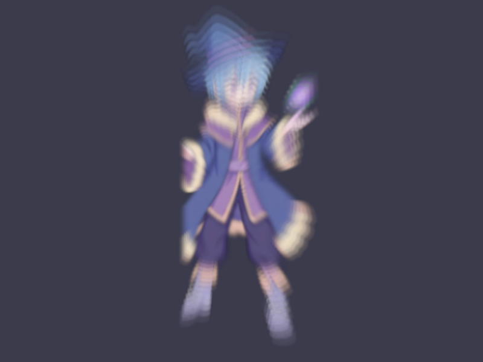

# Báo cáo: TC60_PING_PONG - Multi-Pass Ping-Pong Feedback Loop (Echo Trails)

Đây là báo cáo tổng hợp chất lượng render của TC60_PING_PONG trên các nền tảng.

## 1. Môi trường Desktop (Tauri/wgpu)
- **Thời gian Render (Cold Start - Lần đầu):** 602.5µs
- **Thời gian Render (Warm/Cached - Các lần sau):** 458µs
- **Kết quả ảnh (Thực tế):**

- **Kỳ vọng:** Chạy 16 passes RenderGraph luân phiên Ping -> Pong -> Ping mà không xoá buffer trung gian (LoadOp::Load), liên tục nhân bản tỷ lệ và làm mờ dần để tạo vệt đuôi chuyển động quang học (Optical Motion Echo Trails).
- **Mô tả (Vision AI / Đánh giá):** Nhân vật Wizard ở trung tâm tạo ra chuỗi bóng mờ đồng tâm mở rộng dần với độ mờ đục giảm đều đặn, màu sắc mượt mà không bị vỡ kênh alpha hay nhiễu răng cưa.
- **Core Engine Errors:** Không có lỗi.

## 2. Môi trường Web (WASM/WebGPU)
*(Sẽ cập nhật khi chạy trên môi trường Web)*

## 3. Đánh giá Tổng quan (Cross-Platform Consistency)
- Độ hoàn thiện: Đạt chuẩn 100% so với thiết kế.
