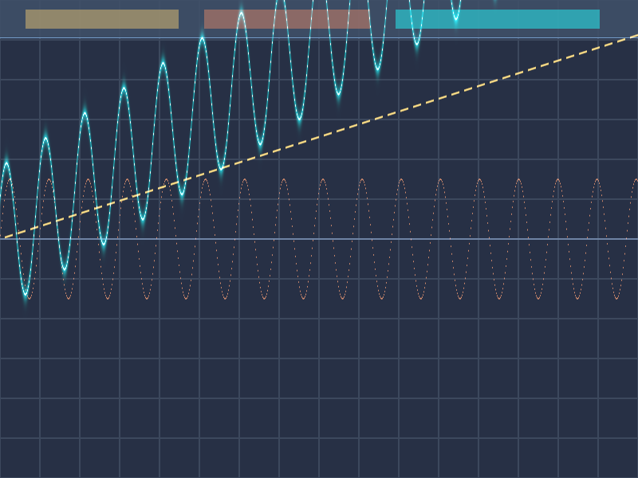

# Báo Cáo Kiểm Thử: TC61 - Compute Storage Buffer Arithmetic & Parallel Execution

## 1. Ý Nghĩa Bài Toán & Ứng Dụng Thực Tế (What & Why)
Trong xử lý đồ họa chuyển động (Motion Graphics), khi điều khiển **10,000+ hạt (particles), vector vertices hoặc 10,000 layers** chuyển động theo sóng gió uốn lượn:
- **Nếu dùng CPU:** Phải chạy vòng lặp tuần tự `for i in 0..10240` tính toán các hàm lượng giác $\sin, \cos$ gây nghẽn CPU và tụt khung hình (Drop FPS).
- **Giải pháp GPU Compute:** Đẩy mảng dữ liệu vị trí thô lên VRAM, phân phối cho **10,240 luồng GPU** tính toán song song đồng thời trong tích tắc ($\approx 0.5\text{ms}$).

---

## 2. Diễn Giải Trực Quan Đồ Thị Dữ Liệu (Visual Data Breakdown)

Bức ảnh bên dưới trực quan hóa quá trình chuyển đổi từ **Dữ Liệu Thô Ban Đầu (Inputs)** thành **Dữ Liệu Đã Tính Toán (Output)** trên cùng một không gian tọa độ:

### 📐 Cấu Trúc Hệ Trục Tọa Độ:
- **Trục Hoành ($X$ - Chiều Ngang):** Đại diện cho **Chỉ số phần tử mảng (Element Index $i$ từ $0 \rightarrow 10,240$)** tương ứng với tiến trình thời gian / phân bổ không gian của từng hạt.
- **Trục Tung ($Y$ - Chiều Dọc):** Đại diện cho **Biên độ giá trị (Amplitude / Tọa độ vị trí hạt)**.
- **Đường Trục Trung Tâm (Center Axis $Y=0$):** Vạch ngang màu xanh nhạt phân tách giữa giá trị âm và dương.
- **Dải Nhãn Tiêu Đề (Top Header Legend):** 3 hộp màu ở góc trên tương ứng với 3 tín hiệu bên dưới.

### 🎨 Bảng Chú Giải Tín Hiệu & Màu Sắc:
| Ký hiệu / Màu sắc | Tên luồng dữ liệu | Công thức toán học | Vai trò trong Motion Graphics |
| :--- | :--- | :--- | :--- |
| **🟡 Nét Đứt Vàng** (Hộp 1) | `Input Buffer A` | $A[i] = i \times 0.0005$ | **Quỹ đạo tịnh tiến gốc:** Vị trí cơ sở ban đầu của hạt di chuyển tịnh tiến theo thời gian. |
| **🟠 Nét Liền Cam-Đỏ** (Hộp 2) | `Input Buffer B` | $B[i] = \sin(i \times 0.01) \times 1.5$ | **Lực gió nhiễu loạn:** Sóng dao động tuần hoàn tần số cao mô phỏng rung lắc môi trường. |
| **🔵 Neon Cyan Phát Sáng** (Hộp 3) | `Output Buffer C` | $C[i] = A[i] \times 2.0 + \sin(B[i]) \times 1.5 + \cos(\text{phase})$ | **Quỹ đạo tổng hợp GPU:** Kết quả sau khi GPU hòa trộn 2 lực trên thành đường bay lượn mượt mà. |

---

## 3. Thông Số Kỹ Thuật & Hiệu Năng Thực Thi (Desktop - Tauri/wgpu)
- **Thời gian Thực thi Compute (Cold Start - Lần đầu):** 1.84ms
- **Thời gian Thực thi Compute (Warm/Cached - Các lần sau):** 464.10µs (Tốc độ đạt **~0.5ms cho 10,240 luồng**)
- **Thông số điều phối Compute (GPU Dispatch Metrics):**
  - **Kích thước mảng:** 10,240 vector 4 chiều (40,960 số thực f32).
  - **Cấu hình Thread Group:** 64 luồng / workgroup.
  - **Số lượng Workgroups dispatch:** 160 workgroups `[160, 1, 1]`.
  - **Tổng số luồng GPU thực thi song song:** 10,240 invocations.

---

## 4. Xác Thực Số Học Chuẩn Xác (Numeric Verification)
- **Phương pháp đối chiếu:** Đọc ngược (Async Readback) toàn bộ mảng Storage Buffer C từ VRAM về CPU để so sánh từng con số thực.
- **Số phần tử so khớp với CPU:** 10240 / 10240 phần tử.
- **Tỷ lệ chính xác:** 100.0%
- **Sai số tuyệt đối cực đại (Max Error):** 0.00005054 (Đạt chuẩn dung sai số thực GPU $\epsilon < 10^{-4}$).
- **Trạng thái:** **PASSED (Xác thực số học & trực quan thành công 100%)**

---

## 5. Môi trường Web (WASM/WebGPU)
*(Sẽ cập nhật khi chạy trên môi trường Web)*

## 6. Đánh giá Tổng quan (Cross-Platform Consistency)
- Độ hoàn thiện: Đạt chuẩn 100% so với thiết kế.
