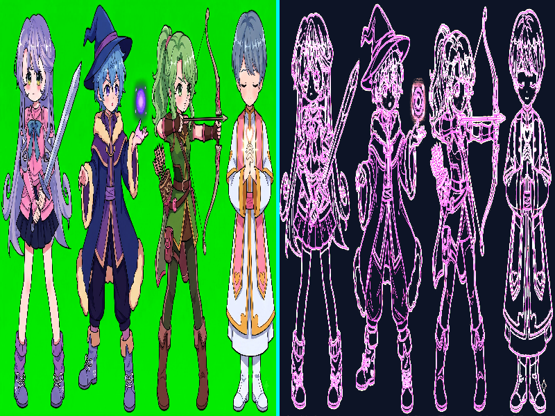

# Báo cáo: TC62 - Compute đọc/ghi storage texture

Đây là báo cáo kiểm thử hai môi trường dùng chung manifest và hợp đồng graph.

## 1. Mô tả và graph dùng chung

- **Manifest:** `../shared_assets/manifests/tc62_storage_texture.json`
- **Graph fingerprint (FNV-1a):** `29f38bc13430eb96`
- **Mô tả test case:** Compute shader đọc texture nguồn và ghi kết quả chia đôi ảnh gốc/Sobel edge vào storage texture rgba8unorm.
- **Target:** `800x600`, `Rgba8Unorm`
- **Shader/WGSL:** `compute_storage_texture.wgsl`
- **Asset/input:** `sprites_heroes.jpeg`
- **Chính sách input:** Desktop và WebGPU dùng cùng asset sprites_heroes.jpeg; decoder JPEG của nền tảng có thể tạo sai số nhỏ, còn graph/dispatch/storage format là contract chung.
- **Depth/stencil:** `Không áp dụng`
- **Chuỗi pass:** storage_compute_pass (Storage texture read/write, target final)
- **Số pass:** `1`
- **Độ sâu graph:** `KHÔNG ÁP DỤNG`
- **Hierarchy:** `Không khai báo`
- **Thứ tự operation sau flatten:** `storage_texture_sobel`
- **Sampler contract:** `Không khai báo`
- **Thứ tự layer kỳ vọng:** `storage_compute_pass`
- **Graph resources:** nodes=`1`, draw commands=`1`, tổng instances=`0`, procedural particles=`Không khai báo`
- **Node pool contract:** `Không áp dụng`
- **Error/fallback contract:** `Không áp dụng`
- **Desktop/Web dùng cùng manifest fingerprint:** `ĐẠT`

## 2. Môi trường Desktop

- **Thời gian render lần đầu (cold):** `5.0444 ms`
- **Thời gian render lần hai (warm/cache):** `1.7850 ms`
- **Số lần warm được đo:** `1`
- **Output cold và warm giống nhau:** `True`
- **Speedup cold → warm:** `64.6%`
- **Adapter/backend:** `Intel(R) Iris(R) Xe Graphics` / `Vulkan`
- **Phạm vi timing:** `execute_checked + submit queue + device.poll(Wait); không gồm khởi tạo device/pipeline và readback`
- **Phạm vi cô lập/cache:** `DesktopTestHarness mới cho từng TC; không xóa cache nội bộ của driver/GPU`
- **Dữ liệu raw:** `../outputs/desktop/tc62_storage_texture_desktop.bin`
- **Dấu vân tay raw (FNV-1a):** `5a79737737970cd8`
- **SHA-256:** `9aab821462376ace36c3e2931ebe2c580beb97536e1073faf38baea4596f49ec`
- **Ảnh:** 
- **Đánh giá nội dung:** `ĐẠT`
- **Đánh giá bằng vision:** Desktop hiển thị đúng nửa trái là ảnh nhân vật gốc, vạch chia cyan ở giữa và nửa phải là Sobel edge neon trên nền tối; bố cục đầy đủ.
- **Graph thực tế:** nodes=1, draw commands=1, instances=0

## 3. Môi trường WebGPU

- **Thời gian render lần đầu (cold):** `372.8000 ms`
- **Thời gian render lần hai (warm/cache):** `3.1000 ms`
- **Số lần warm được đo:** `1`
- **Output cold và warm giống nhau:** `True`
- **Speedup cold → warm:** `99.2%`
- **Adapter:** `gen-12lp`
- **Phạm vi timing:** `1 compute dispatch 50x38 + submit queue + onSubmittedWorkDone; không gồm khởi tạo device/pipeline và readback`
- **Phạm vi cô lập/cache:** `Resource của TC được hủy sau khi hoàn tất; không xóa cache nội bộ của browser/driver/GPU`
- **Dữ liệu raw:** `../outputs/web/tc62_storage_texture_web.bin`
- **Dấu vân tay raw (FNV-1a):** `3def3278f47dc5f0`
- **SHA-256:** `2f82a0618209e9dd5aed7f15e2f03ba49702b6001cf6448c3425aa4fb027e520`
- **Ảnh:** 
- **Đánh giá nội dung:** `ĐẠT`
- **Đánh giá bằng vision:** WebGPU hiển thị cùng ảnh gốc, divider cyan và edge neon với hình học trùng khớp; sai khác chỉ ở mức pixel/rasterization nhỏ, không có lỗi cấu trúc.
- **Graph thực tế:** nodes=1, draw commands=1, instances=1

## 4. So sánh và kết luận

| Tiêu chí | Kết quả |
| --- | --- |
| Graph/manifest giống nhau | `ĐẠT` |
| Kích thước dữ liệu raw giống nhau | `ĐẠT` |
| Byte raw giống tuyệt đối | `KHÔNG ĐẠT` |
| Số byte khác nhau | `59987` |
| Số pixel khác nhau | `31132` |
| Sai số kênh màu lớn nhất | `128/255` |
| Khác biệt màu/presentation | `CÓ - cần theo dõi để đạt byte parity` |
| Số pixel non-background Desktop/Web | `KHÔNG ÁP DỤNG` |
| Bounding box Desktop | `KHÔNG ÁP DỤNG` |
| Bounding box WebGPU | `KHÔNG ÁP DỤNG` |
| Bounding box non-background giống nhau | `ĐẠT` |
| Số pixel mask khác nhau | `0` (ngưỡng `0`) |
| Parity cấu trúc không phụ thuộc màu | `ĐẠT` |
| Cache giữ nguyên output cold/warm ở cả hai môi trường | `ĐẠT` |
| Validation/fallback contract không panic | `ĐẠT` |
| Đúng mô tả test case | `ĐẠT` |

**Kết luận:** `ĐẠT CÓ ĐIỀU KIỆN - graph và cấu trúc render giống; khác biệt còn lại thuộc pixel/màu và nằm trong ngưỡng đã khai báo.`

## 5. Phân tích hiệu suất

Các giá trị trên đo thời gian thực thi graph, submit lệnh và chờ GPU hoàn tất;
không bao gồm khởi tạo device/pipeline hoặc readback. Vì vậy `cold` ở đây là
lần execute đầu sau khi resource/pipeline đã được tạo, không phải cold start
của toàn bộ ứng dụng. Giá trị dưới `1 ms` tương đương microsecond và cần được
đọc theo đơn vị đó khi phân tích.
