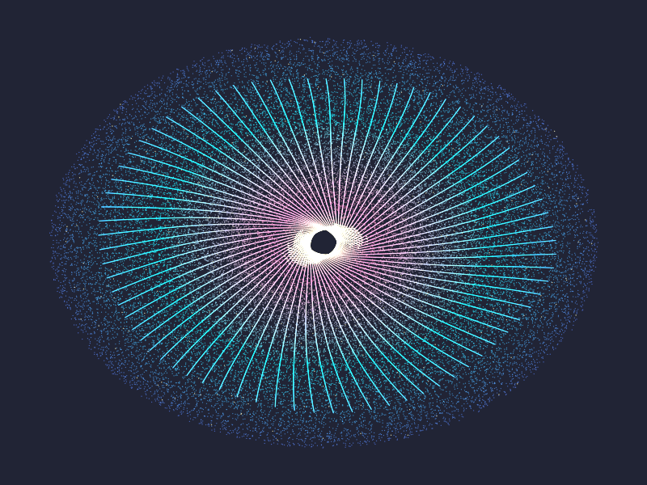
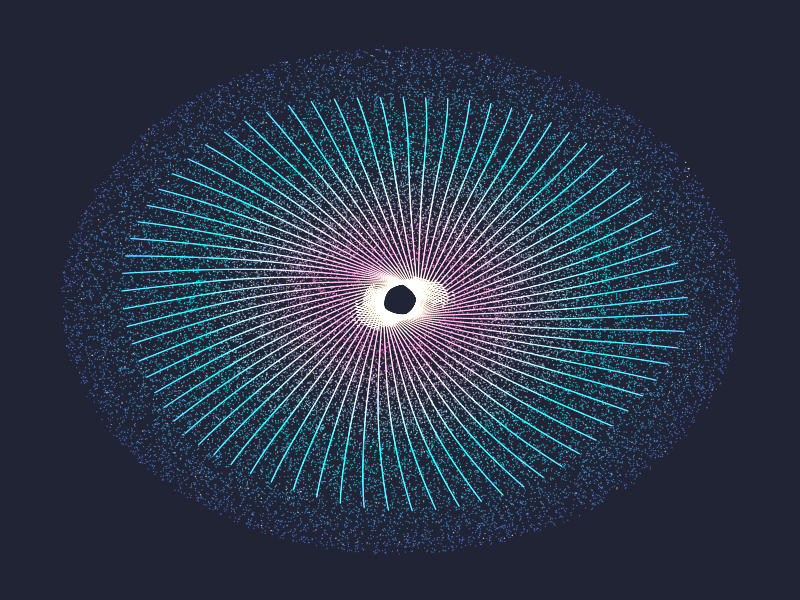

# Báo cáo: TC63 - Mô phỏng 100.000 hạt GPU

Đây là báo cáo kiểm thử hai môi trường dùng chung manifest và hợp đồng graph.

## 1. Mô tả và graph dùng chung

- **Manifest:** `../shared_assets/manifests/tc63_particles_100k.json`
- **Graph fingerprint (FNV-1a):** `49c5ea09d42ea7cb`
- **Mô tả test case:** Mô phỏng 100.000 hạt xác định qua 30 bước compute rồi render thành thiên hà điểm sáng additive.
- **Target:** `800x600`, `Rgba8UnormSrgb`
- **Shader/WGSL:** `compute_particles_100k.wgsl`, `render_particles_instanced.wgsl`
- **Asset/input:** KHÔNG KHAI BÁO
- **Chính sách input:** Desktop và WebGPU tự tạo cùng dữ liệu particle f32 từ index; không dùng decoder texture cho dữ liệu mô phỏng.
- **Depth/stencil:** `Không áp dụng`
- **Chuỗi pass:** simulation_pass (30 particle compute steps, target particle_buffer) → render_pass (100k additive particle draw, target final)
- **Số pass:** `2`
- **Độ sâu graph:** `KHÔNG ÁP DỤNG`
- **Hierarchy:** `Không khai báo`
- **Thứ tự operation sau flatten:** `particle_simulation → particle_draw`
- **Sampler contract:** `Không khai báo`
- **Thứ tự layer kỳ vọng:** `simulation_pass → render_pass`
- **Graph resources:** nodes=`2`, draw commands=`31`, tổng instances=`100030`, procedural particles=`Không khai báo`
- **Node pool contract:** `Không áp dụng`
- **Error/fallback contract:** `Không áp dụng`
- **Desktop/Web dùng cùng manifest fingerprint:** `ĐẠT`

## 2. Môi trường Desktop

- **Thời gian render lần đầu (cold):** `9.1817 ms`
- **Thời gian render lần hai (warm/cache):** `7.6152 ms`
- **Số lần warm được đo:** `1`
- **Output cold và warm giống nhau:** `True`
- **Speedup cold → warm:** `17.1%`
- **Adapter/backend:** `Intel(R) Iris(R) Xe Graphics` / `Vulkan`
- **Phạm vi timing:** `execute_checked + submit queue + device.poll(Wait); không gồm khởi tạo device/pipeline và readback`
- **Phạm vi cô lập/cache:** `DesktopTestHarness mới cho từng TC; không xóa cache nội bộ của driver/GPU`
- **Dữ liệu raw:** `../outputs/desktop/tc63_particles_100k_desktop.bin`
- **Dấu vân tay raw (FNV-1a):** `cca64871b934d6a9`
- **SHA-256:** `10b4fe122fe6f99ebbc0554512d4a1d2f3313c0910454cf671ad28c7057d4b30`
- **Ảnh:** 
- **Đánh giá nội dung:** `ĐẠT`
- **Đánh giá bằng vision:** Desktop hiển thị thiên hà spiral dày với lõi sáng, gradient cyan/magenta và vùng hạt ngoài; không rỗng, không có artifact cấu trúc.
- **Graph thực tế:** nodes=2, draw commands=31, instances=100030

## 3. Môi trường WebGPU

- **Thời gian render lần đầu (cold):** `125.3000 ms`
- **Thời gian render lần hai (warm/cache):** `10.5000 ms`
- **Số lần warm được đo:** `1`
- **Output cold và warm giống nhau:** `True`
- **Speedup cold → warm:** `91.6%`
- **Adapter:** `gen-12lp`
- **Phạm vi timing:** `30 compute passes + 100k instanced draw + submit queue + onSubmittedWorkDone; không gồm khởi tạo device/pipeline và readback`
- **Phạm vi cô lập/cache:** `Resource của TC được hủy sau khi hoàn tất; không xóa cache nội bộ của browser/driver/GPU`
- **Dữ liệu raw:** `../outputs/web/tc63_particles_100k_web.bin`
- **Dấu vân tay raw (FNV-1a):** `af93f0f973ebb64c`
- **SHA-256:** `04bbb83f14b29ee50c0aea1e667d6e9f6e6e25a393a9d48a9b3982aa9691ebdb`
- **Ảnh:** 
- **Đánh giá nội dung:** `ĐẠT`
- **Đánh giá bằng vision:** WebGPU hiển thị cùng thiên hà spiral, lõi sáng và phân bố hạt; khác biệt chủ yếu ở mật độ/rasterization điểm và floating-point backend, không có NaN hay hình ảnh sai cấu trúc.
- **Graph thực tế:** nodes=2, draw commands=31, instances=2

## 4. So sánh và kết luận

| Tiêu chí | Kết quả |
| --- | --- |
| Graph/manifest giống nhau | `ĐẠT` |
| Kích thước dữ liệu raw giống nhau | `ĐẠT` |
| Byte raw giống tuyệt đối | `KHÔNG ĐẠT` |
| Số byte khác nhau | `204777` |
| Số pixel khác nhau | `74419` |
| Sai số kênh màu lớn nhất | `222/255` |
| Khác biệt màu/presentation | `CÓ - cần theo dõi để đạt byte parity` |
| Số pixel non-background Desktop/Web | `KHÔNG ÁP DỤNG` |
| Bounding box Desktop | `KHÔNG ÁP DỤNG` |
| Bounding box WebGPU | `KHÔNG ÁP DỤNG` |
| Bounding box non-background giống nhau | `ĐẠT` |
| Số pixel mask khác nhau | `0` (ngưỡng `0`) |
| Parity cấu trúc không phụ thuộc màu | `ĐẠT` |
| Cache giữ nguyên output cold/warm ở cả hai môi trường | `ĐẠT` |
| Validation/fallback contract không panic | `ĐẠT` |
| Đúng mô tả test case | `ĐẠT` |

**Kết luận:** `ĐẠT CÓ ĐIỀU KIỆN - graph và cấu trúc render giống; khác biệt còn lại thuộc pixel/màu và nằm trong ngưỡng đã khai báo.`

## 5. Phân tích hiệu suất

Các giá trị trên đo thời gian thực thi graph, submit lệnh và chờ GPU hoàn tất;
không bao gồm khởi tạo device/pipeline hoặc readback. Vì vậy `cold` ở đây là
lần execute đầu sau khi resource/pipeline đã được tạo, không phải cold start
của toàn bộ ứng dụng. Giá trị dưới `1 ms` tương đương microsecond và cần được
đọc theo đơn vị đó khi phân tích.
