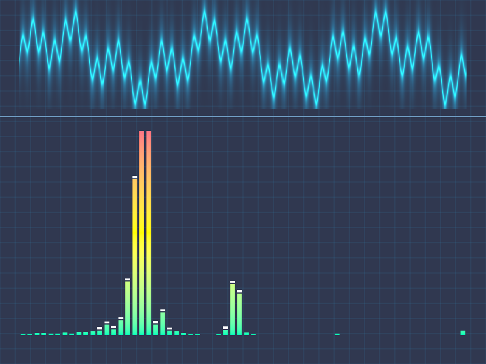

# Báo cáo: TC64 - Visualizer FFT âm thanh bằng GPU

Đây là báo cáo kiểm thử hai môi trường dùng chung manifest và hợp đồng graph.

## 1. Mô tả và graph dùng chung

- **Manifest:** `../shared_assets/manifests/tc64_audio_fft.json`
- **Graph fingerprint (FNV-1a):** `eb63136e435ed1cb`
- **Mô tả test case:** Phân tích tín hiệu tổng hợp 4096 mẫu thành 64 dải phổ rồi render oscilloscope và equalizer.
- **Target:** `800x600`, `Rgba8UnormSrgb`
- **Shader/WGSL:** `compute_audio_fft.wgsl`, `render_audio_spectrum.wgsl`
- **Asset/input:** KHÔNG KHAI BÁO
- **Chính sách input:** Desktop và WebGPU tự tạo cùng tín hiệu PCM f32 xác định; không phụ thuộc microphone hoặc decoder media của nền tảng.
- **Depth/stencil:** `Không áp dụng`
- **Chuỗi pass:** fft_pass (64-bin audio FFT, target spectrum_buffer) → visualizer_pass (Oscilloscope and spectrum, target final)
- **Số pass:** `2`
- **Độ sâu graph:** `KHÔNG ÁP DỤNG`
- **Hierarchy:** `Không khai báo`
- **Thứ tự operation sau flatten:** `audio_fft → audio_visualizer`
- **Sampler contract:** `Không khai báo`
- **Thứ tự layer kỳ vọng:** `fft_pass → visualizer_pass`
- **Graph resources:** nodes=`2`, draw commands=`2`, tổng instances=`1`, procedural particles=`Không khai báo`
- **Node pool contract:** `Không áp dụng`
- **Error/fallback contract:** `Không áp dụng`
- **Desktop/Web dùng cùng manifest fingerprint:** `ĐẠT`

## 2. Môi trường Desktop

- **Thời gian render lần đầu (cold):** `6.8156 ms`
- **Thời gian render lần hai (warm/cache):** `6.3798 ms`
- **Số lần warm được đo:** `1`
- **Output cold và warm giống nhau:** `True`
- **Speedup cold → warm:** `6.4%`
- **Adapter/backend:** `Intel(R) Iris(R) Xe Graphics` / `Vulkan`
- **Phạm vi timing:** `execute_checked + submit queue + device.poll(Wait); không gồm khởi tạo device/pipeline và readback`
- **Phạm vi cô lập/cache:** `DesktopTestHarness mới cho từng TC; không xóa cache nội bộ của driver/GPU`
- **Dữ liệu raw:** `../outputs/desktop/tc64_audio_fft_desktop.bin`
- **Dấu vân tay raw (FNV-1a):** `52a69028097c032a`
- **SHA-256:** `6446ca6023ca39b56e33f589681deab11a63e8f909bc89e77fb3bda1a6f0a93d`
- **Ảnh:** 
- **Đánh giá nội dung:** `ĐẠT`
- **Đánh giá bằng vision:** Desktop hiển thị waveform cyan ở phần trên và 64 cột FFT gradient ở phần dưới, có peak cap và grid rõ; phổ có đỉnh năng lượng hợp lệ.
- **Graph thực tế:** nodes=2, draw commands=2, instances=1

## 3. Môi trường WebGPU

- **Thời gian render lần đầu (cold):** `116.0000 ms`
- **Thời gian render lần hai (warm/cache):** `5.6000 ms`
- **Số lần warm được đo:** `1`
- **Output cold và warm giống nhau:** `True`
- **Speedup cold → warm:** `95.2%`
- **Adapter:** `gen-12lp`
- **Phạm vi timing:** `1 compute FFT dispatch + 1 visualizer pass + submit queue + onSubmittedWorkDone; không gồm khởi tạo device/pipeline và readback`
- **Phạm vi cô lập/cache:** `Resource của TC được hủy sau khi hoàn tất; không xóa cache nội bộ của browser/driver/GPU`
- **Dữ liệu raw:** `../outputs/web/tc64_audio_fft_web.bin`
- **Dấu vân tay raw (FNV-1a):** `afd1654dbe424bae`
- **SHA-256:** `abe602106de3f6594c8bd345c9097da2b63b05eb4d473e60114803cb2cfa7194`
- **Ảnh:** 
- **Đánh giá nội dung:** `ĐẠT`
- **Đánh giá bằng vision:** WebGPU hiển thị cùng waveform, divider, grid và dải cột FFT; cấu trúc/đỉnh chính giống Desktop, khác biệt màu và biên nhỏ do floating-point backend.
- **Graph thực tế:** nodes=2, draw commands=2, instances=2

## 4. So sánh và kết luận

| Tiêu chí | Kết quả |
| --- | --- |
| Graph/manifest giống nhau | `ĐẠT` |
| Kích thước dữ liệu raw giống nhau | `ĐẠT` |
| Byte raw giống tuyệt đối | `KHÔNG ĐẠT` |
| Số byte khác nhau | `3893` |
| Số pixel khác nhau | `2088` |
| Sai số kênh màu lớn nhất | `99/255` |
| Khác biệt màu/presentation | `CÓ - cần theo dõi để đạt byte parity` |
| Số pixel non-background Desktop/Web | `KHÔNG ÁP DỤNG` |
| Bounding box Desktop | `KHÔNG ÁP DỤNG` |
| Bounding box WebGPU | `KHÔNG ÁP DỤNG` |
| Bounding box non-background giống nhau | `ĐẠT` |
| Số pixel mask khác nhau | `0` (ngưỡng `0`) |
| Parity cấu trúc không phụ thuộc màu | `ĐẠT` |
| Cache giữ nguyên output cold/warm ở cả hai môi trường | `ĐẠT` |
| Validation/fallback contract không panic | `ĐẠT` |
| Đúng mô tả test case | `ĐẠT` |

**Kết luận:** `ĐẠT CÓ ĐIỀU KIỆN - graph và cấu trúc render giống; khác biệt còn lại thuộc pixel/màu và nằm trong ngưỡng đã khai báo.`

## 5. Phân tích hiệu suất

Các giá trị trên đo thời gian thực thi graph, submit lệnh và chờ GPU hoàn tất;
không bao gồm khởi tạo device/pipeline hoặc readback. Vì vậy `cold` ở đây là
lần execute đầu sau khi resource/pipeline đã được tạo, không phải cold start
của toàn bộ ứng dụng. Giá trị dưới `1 ms` tương đương microsecond và cần được
đọc theo đơn vị đó khi phân tích.
