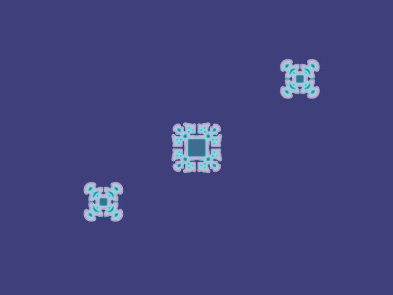

# Báo cáo: TC67 - Reaction-diffusion qua ping-pong texture

Đây là báo cáo kiểm thử hai môi trường dùng chung manifest và hợp đồng graph.

## 1. Mô tả và graph dùng chung

- **Manifest:** `../shared_assets/manifests/tc67_pingpong.json`
- **Graph fingerprint (FNV-1a):** `92b7444c45f8deee`
- **Mô tả test case:** Chạy 2.480 bước Gray-Scott tương đương hành vi runner cũ bằng hai storage texture luân phiên, sau đó ánh xạ nồng độ sang màu.
- **Target:** `800x600`, `Rgba8UnormSrgb`
- **Shader/WGSL:** `compute_reaction_diffusion.wgsl`, `render_reaction_diffusion.wgsl`
- **Asset/input:** KHÔNG KHAI BÁO
- **Chính sách input:** Desktop và WebGPU tạo cùng seed deterministic trong texture A; texture B được ghi ở bước đầu, không dùng input decoder.
- **Depth/stencil:** `Không áp dụng`
- **Chuỗi pass:** reaction_pass (2,480-step Gray-Scott ping-pong, target texture_a_or_b) → color_pass (Reaction-diffusion color mapping, target final)
- **Số pass:** `2`
- **Độ sâu graph:** `KHÔNG ÁP DỤNG`
- **Hierarchy:** `Không khai báo`
- **Thứ tự operation sau flatten:** `reaction_diffusion → color_mapping`
- **Sampler contract:** `Không khai báo`
- **Thứ tự layer kỳ vọng:** `reaction_pass → color_pass`
- **Graph resources:** nodes=`2`, draw commands=`2481`, tổng instances=`1`, procedural particles=`Không khai báo`
- **Node pool contract:** `Không áp dụng`
- **Error/fallback contract:** `Không áp dụng`
- **Desktop/Web dùng cùng manifest fingerprint:** `ĐẠT`

## 2. Môi trường Desktop

- **Thời gian render lần đầu (cold):** `257.8356 ms`
- **Thời gian render lần hai (warm/cache):** `230.1812 ms`
- **Số lần warm được đo:** `1`
- **Output cold và warm giống nhau:** `True`
- **Speedup cold → warm:** `10.7%`
- **Adapter/backend:** `Intel(R) Iris(R) Xe Graphics` / `Vulkan`
- **Phạm vi timing:** `execute_checked + submit queue + device.poll(Wait); không gồm khởi tạo device/pipeline và readback`
- **Phạm vi cô lập/cache:** `DesktopTestHarness mới cho từng TC; state mutable được reset trước warm; không xóa cache nội bộ của driver/GPU`
- **Dữ liệu raw:** `../outputs/desktop/tc67_pingpong_desktop.bin`
- **Dấu vân tay raw (FNV-1a):** `12390712dcaa8acc`
- **SHA-256:** `840608b933f43b57a2b68e60f6d9dbd5efacc0241deef350eda5a5deaef9f145`
- **Ảnh:** 
- **Đánh giá nội dung:** `ĐẠT`
- **Đánh giá bằng vision:** Desktop hiển thị nền tím tối và ba pattern Gray-Scott cyan/hồng phát triển từ các seed; bố cục và pattern đúng mô tả sau 2480 bước.
- **Graph thực tế:** nodes=2, draw commands=2481, instances=1

## 3. Môi trường WebGPU

- **Thời gian render lần đầu (cold):** `365.6000 ms`
- **Thời gian render lần hai (warm/cache):** `274.0000 ms`
- **Số lần warm được đo:** `1`
- **Output cold và warm giống nhau:** `True`
- **Speedup cold → warm:** `25.1%`
- **Adapter:** `gen-12lp`
- **Phạm vi timing:** `2480 compute ping-pong passes + 1 color mapping pass + submit queue + onSubmittedWorkDone; không gồm khởi tạo device/pipeline và readback`
- **Phạm vi cô lập/cache:** `Resource của TC được hủy sau khi hoàn tất; state mutable được reset trước warm; không xóa cache nội bộ của browser/driver/GPU`
- **Dữ liệu raw:** `../outputs/web/tc67_pingpong_web.bin`
- **Dấu vân tay raw (FNV-1a):** `342c4537eef480b7`
- **SHA-256:** `9ddac8d46083f591048b6345950ab60c42a1149a6018206508295719f355dc22`
- **Ảnh:** 
- **Đánh giá nội dung:** `ĐẠT`
- **Đánh giá bằng vision:** WebGPU hiển thị cùng nền và ba pattern Gray-Scott deterministic; cấu trúc trùng khớp, khác biệt nhỏ do floating-point/rasterization, không có lỗi hazard.
- **Graph thực tế:** nodes=2, draw commands=2481, instances=1

## 4. So sánh và kết luận

| Tiêu chí | Kết quả |
| --- | --- |
| Graph/manifest giống nhau | `ĐẠT` |
| Kích thước dữ liệu raw giống nhau | `ĐẠT` |
| Byte raw giống tuyệt đối | `KHÔNG ĐẠT` |
| Số byte khác nhau | `8095` |
| Số pixel khác nhau | `6380` |
| Sai số kênh màu lớn nhất | `10/255` |
| Khác biệt màu/presentation | `CÓ - cần theo dõi để đạt byte parity` |
| Số pixel non-background Desktop/Web | `KHÔNG ÁP DỤNG` |
| Bounding box Desktop | `KHÔNG ÁP DỤNG` |
| Bounding box WebGPU | `KHÔNG ÁP DỤNG` |
| Bounding box non-background giống nhau | `ĐẠT` |
| Số pixel mask khác nhau | `0` (ngưỡng `0`) |
| Parity cấu trúc không phụ thuộc màu | `ĐẠT` |
| Cache giữ nguyên output cold/warm ở cả hai môi trường | `ĐẠT` |
| Validation/fallback contract không panic | `ĐẠT` |
| Đúng mô tả test case | `ĐẠT` |

**Kết luận:** `ĐẠT CÓ ĐIỀU KIỆN - graph và cấu trúc render giống; khác biệt còn lại thuộc pixel/màu và nằm trong ngưỡng đã khai báo.`

## 5. Phân tích hiệu suất

Các giá trị trên đo thời gian thực thi graph, submit lệnh và chờ GPU hoàn tất;
không bao gồm khởi tạo device/pipeline hoặc readback. Vì vậy `cold` ở đây là
lần execute đầu sau khi resource/pipeline đã được tạo, không phải cold start
của toàn bộ ứng dụng. Giá trị dưới `1 ms` tương đương microsecond và cần được
đọc theo đơn vị đó khi phân tích.
