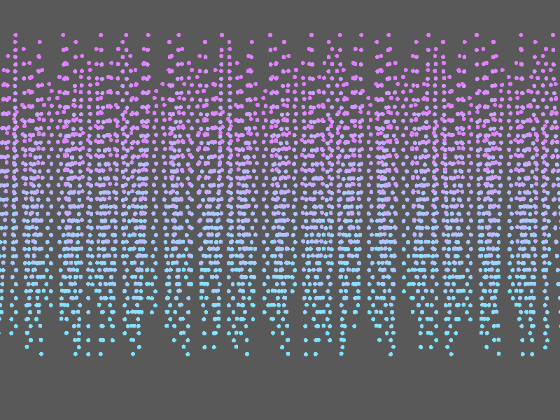
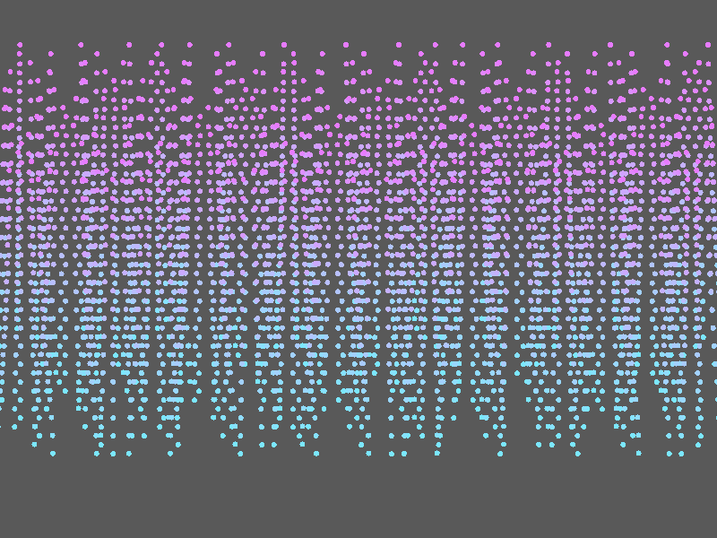

# Báo cáo: TC68 - Mô phỏng chuỗi Verlet trên GPU

Đây là báo cáo kiểm thử hai môi trường dùng chung manifest và hợp đồng graph.

## 1. Mô tả và graph dùng chung

- **Manifest:** `crates/ifol-gpu/tests/shared_assets/manifests/tc68_verlet.json`
- **Graph fingerprint (FNV-1a):** `57c2a130c0067d22`
- **Mô tả test case:** Tích phân và giải ràng buộc 256 chuỗi, mỗi chuỗi 16 node trong 100 bước, sau đó render 4.096 node.
- **Target:** `800x600`, `Rgba8UnormSrgb`
- **Shader/WGSL:** `render_chains.wgsl`
- **Asset/input:** KHÔNG KHAI BÁO
- **Chính sách input:** Desktop và WebGPU tạo cùng node positions và time=5.0; node buffer được reset trước warm.
- **Depth/stencil:** `Không áp dụng`
- **Chuỗi pass:** simulation_pass (100-step Verlet integration and constraints, target nodes_buffer) → render_pass (Instanced chain nodes, target final)
- **Số pass:** `2`
- **Độ sâu graph:** `KHÔNG ÁP DỤNG`
- **Hierarchy:** `Không khai báo`
- **Thứ tự operation sau flatten:** `verlet_simulation → render_chains`
- **Sampler contract:** `Không khai báo`
- **Thứ tự layer kỳ vọng:** `simulation_pass → render_pass`
- **Graph resources:** nodes=`2`, draw commands=`201`, tổng instances=`4096`, procedural particles=`Không khai báo`
- **Node pool contract:** `Không áp dụng`
- **Error/fallback contract:** `Không áp dụng`
- **Desktop/Web dùng cùng manifest fingerprint:** `ĐẠT`

## 2. Môi trường Desktop

- **Thời gian render lần đầu (cold):** `19.0802 ms`
- **Thời gian render lần hai (warm/cache):** `16.7543 ms`
- **Số lần warm được đo:** `1`
- **Output cold và warm giống nhau:** `True`
- **Speedup cold → warm:** `12.2%`
- **Adapter/backend:** `Intel(R) Iris(R) Xe Graphics` / `Vulkan`
- **Phạm vi timing:** `execute_checked + submit queue + device.poll(Wait); không gồm khởi tạo device/pipeline và readback`
- **Phạm vi cô lập/cache:** `DesktopTestHarness mới cho từng TC; state mutable được reset trước warm; không xóa cache nội bộ của driver/GPU`
- **Dữ liệu raw:** `crates/ifol-gpu/tests/outputs/desktop/tc68_verlet_desktop.bin`
- **Dấu vân tay raw (FNV-1a):** `7130031f19a8afeb`
- **SHA-256:** `51e03e3b6cf23f852a25a47c7f0e1875e177da1f0352bb7278b2bafc38ac5aae`
- **Ảnh:** 
- **Đánh giá nội dung:** `ĐẠT`
- **Đánh giá bằng vision:** Desktop hiển thị đầy đủ các chuỗi node dạng chấm, chuyển sắc tím-cyan từ trên xuống dưới trên nền xám; bố cục ổn định, không thấy nổ hoặc vùng rác.
- **Graph thực tế:** nodes=2, draw commands=201, instances=4096

## 3. Môi trường WebGPU

- **Thời gian render lần đầu (cold):** `420.9000 ms`
- **Thời gian render lần hai (warm/cache):** `10.8000 ms`
- **Số lần warm được đo:** `1`
- **Output cold và warm giống nhau:** `True`
- **Speedup cold → warm:** `97.4%`
- **Adapter:** `gen-12lp`
- **Phạm vi timing:** `200 compute dispatches + 4096 instanced node quads + submit queue + onSubmittedWorkDone; không gồm khởi tạo device/pipeline và readback`
- **Phạm vi cô lập/cache:** `Resource của TC được hủy sau khi hoàn tất; state mutable được reset trước warm; không xóa cache nội bộ của browser/driver/GPU`
- **Dữ liệu raw:** `crates/ifol-gpu/tests/outputs/web/tc68_verlet_web.bin`
- **Dấu vân tay raw (FNV-1a):** `264aa4543eceeb4f`
- **SHA-256:** `ee6a43b0fd0c0e3034a19c232d8b3f0e885bda698f1e2ecef36d4a7f1b1b6909`
- **Ảnh:** 
- **Đánh giá nội dung:** `ĐẠT`
- **Đánh giá bằng vision:** WebGPU hiển thị cùng bố cục chuỗi node, cùng chuyển sắc tím-cyan và nền xám; không thấy nổ hoặc vùng rác.
- **Graph thực tế:** nodes=2, draw commands=201, instances=4096

## 4. So sánh và kết luận

| Tiêu chí | Kết quả |
| --- | --- |
| Graph/manifest giống nhau | `ĐẠT` |
| Kích thước dữ liệu raw giống nhau | `ĐẠT` |
| Byte raw giống tuyệt đối | `KHÔNG ĐẠT` |
| Số byte khác nhau | `48` |
| Số pixel khác nhau | `17` |
| Sai số kênh màu lớn nhất | `166/255` |
| Khác biệt màu/presentation | `CÓ - cần theo dõi để đạt byte parity` |
| Số pixel non-background Desktop/Web | `KHÔNG ÁP DỤNG` |
| Bounding box Desktop | `KHÔNG ÁP DỤNG` |
| Bounding box WebGPU | `KHÔNG ÁP DỤNG` |
| Bounding box non-background giống nhau | `ĐẠT` |
| Số pixel mask khác nhau | `0` (ngưỡng `0`) |
| Parity cấu trúc không phụ thuộc màu | `ĐẠT` |
| Cache giữ nguyên output cold/warm ở cả hai môi trường | `ĐẠT` |
| Validation/fallback contract không panic | `ĐẠT` |
| Đúng mô tả test case | `ĐẠT` |

**Kết luận:** `ĐẠT CÓ ĐIỀU KIỆN - graph và cấu trúc render giống; khác biệt còn lại thuộc pixel/màu và nằm trong ngưỡng đã khai báo.`

## 5. Phân tích hiệu suất

Các giá trị trên đo thời gian thực thi graph, submit lệnh và chờ GPU hoàn tất;
không bao gồm khởi tạo device/pipeline hoặc readback. Vì vậy `cold` ở đây là
lần execute đầu sau khi resource/pipeline đã được tạo, không phải cold start
của toàn bộ ứng dụng. Giá trị dưới `1 ms` tương đương microsecond và cần được
đọc theo đơn vị đó khi phân tích.
