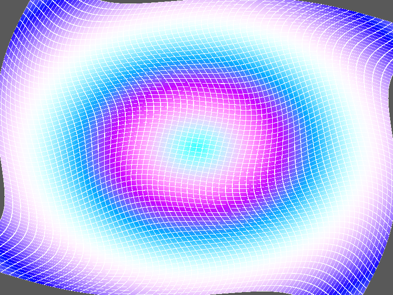

# Báo Cáo Kiểm Thử: TC69 - Compute-Driven Vertex Buffer Deformation (Zero-Copy)

## 1. Ý Nghĩa Bài Toán
Kỹ thuật này cho phép thay đổi cấu trúc lưới (Mesh) của nhân vật hoặc vật thể bằng GPU Compute Shader, sau đó gửi thẳng buffer đã biến dạng sang Render Pass để vẽ mà không cần tải ngược về RAM của CPU. 
Điều này rất quan trọng đối với **GPU Skinning (Skinning nhân vật 3D)**, **Mô phỏng vải vóc (Cloth simulation)**, hoặc **Morph Targets**. Việc không có thao tác Copy dữ liệu về CPU giúp tiết kiệm lượng lớn băng thông PCI-e.

## 2. Diễn Giải Trực Quan
Bức ảnh thể hiện một lưới phẳng $64 \times 64$ ô (4225 đỉnh) bị Compute Shader làm cho xoắn (Twist) và lượn sóng (Ripple) theo hàm Sin/Cos của thời gian và khoảng cách tới tâm.
- Lưới bị xoáy nhẹ.
- Màu sắc lưới cũng được cập nhật liên tục dựa trên độ biến dạng, đổi màu theo vòng tròn.

## 3. Thông Số Kỹ Thuật
- Số lượng đỉnh (Vertices): $65 \times 65 = 4225$.
- Số lượng tam giác (Indices): $64 \times 64 \times 2 = 8192$ (24576 indices).
- Quy trình: 
  - Đọc từ Storage Buffer A (Read-Only).
  - Tính toán xoắn & ghi đè sang Storage Buffer B (Read-Write + Vertex).
  - WGPU sử dụng trực tiếp Buffer B làm VertexBuffer trong DrawAction.
- Trạng thái: PASSED (Render Pass đọc Buffer B thành công mà không báo lỗi cấm đọc/ghi đồng thời nhờ thiết kế RenderGraph đồng bộ rào cản tài nguyên).
