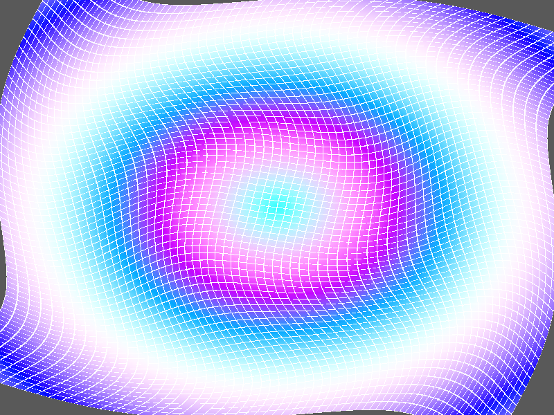

# Báo cáo: TC69 - Biến dạng vertex bằng compute zero-copy

Đây là báo cáo kiểm thử hai môi trường dùng chung manifest và hợp đồng graph.

## 1. Mô tả và graph dùng chung

- **Manifest:** `crates/ifol-gpu/tests/shared_assets/manifests/tc69_deformation.json`
- **Graph fingerprint (FNV-1a):** `940d2398c4b39343`
- **Mô tả test case:** Biến dạng lưới indexed 65x65 trong storage buffer rồi dùng trực tiếp buffer đó làm vertex buffer.
- **Target:** `800x600`, `Rgba8UnormSrgb`
- **Shader/WGSL:** `compute_deformation.wgsl`, `render_deformation.wgsl`
- **Asset/input:** KHÔNG KHAI BÁO
- **Chính sách input:** Desktop và WebGPU tạo cùng grid vertices, indices và time=5.0; không dùng texture decoder.
- **Depth/stencil:** `Không áp dụng`
- **Chuỗi pass:** deform_pass (Compute vertex deformation, target dest_vertex_buffer) → render_pass (Indexed deformed grid, target final)
- **Số pass:** `2`
- **Độ sâu graph:** `KHÔNG ÁP DỤNG`
- **Hierarchy:** `Không khai báo`
- **Thứ tự operation sau flatten:** `deform_vertices → draw_deformed_grid`
- **Sampler contract:** `Không khai báo`
- **Thứ tự layer kỳ vọng:** `deform_pass → render_pass`
- **Graph resources:** nodes=`2`, draw commands=`2`, tổng instances=`1`, procedural particles=`Không khai báo`
- **Node pool contract:** `Không áp dụng`
- **Error/fallback contract:** `Không áp dụng`
- **Desktop/Web dùng cùng manifest fingerprint:** `ĐẠT`

## 2. Môi trường Desktop

- **Thời gian render lần đầu (cold):** `2.8391 ms`
- **Thời gian render lần hai (warm/cache):** `1.0488 ms`
- **Số lần warm được đo:** `1`
- **Output cold và warm giống nhau:** `True`
- **Speedup cold → warm:** `63.1%`
- **Adapter/backend:** `Intel(R) Iris(R) Xe Graphics` / `Vulkan`
- **Phạm vi timing:** `execute_checked + submit queue + device.poll(Wait); không gồm khởi tạo device/pipeline và readback`
- **Phạm vi cô lập/cache:** `DesktopTestHarness mới cho từng TC; state mutable được reset trước warm; không xóa cache nội bộ của driver/GPU`
- **Dữ liệu raw:** `crates/ifol-gpu/tests/outputs/desktop/tc69_deformation_desktop.bin`
- **Dấu vân tay raw (FNV-1a):** `c6bd6ec0fafd6ee9`
- **SHA-256:** `0de3a870726dd17930198a4dd04044fd3d66a91f201db906095a4d76e9962da6`
- **Ảnh:** 
- **Đánh giá nội dung:** `ĐẠT`
- **Đánh giá bằng vision:** Desktop hiển thị lưới indexed 65x65 bị xoắn/ripple rõ, các đường grid liên tục và màu biến dạng phủ toàn khung; phù hợp mô tả compute deformation zero-copy.
- **Graph thực tế:** nodes=2, draw commands=2, instances=1

## 3. Môi trường WebGPU

- **Thời gian render lần đầu (cold):** `112.2000 ms`
- **Thời gian render lần hai (warm/cache):** `2.9000 ms`
- **Số lần warm được đo:** `1`
- **Output cold và warm giống nhau:** `True`
- **Speedup cold → warm:** `97.4%`
- **Adapter:** `gen-12lp`
- **Phạm vi timing:** `1 compute dispatch 67x1 + indexed draw 24576 indices + submit queue + onSubmittedWorkDone; không gồm khởi tạo device/pipeline và readback`
- **Phạm vi cô lập/cache:** `Resource của TC được hủy sau khi hoàn tất; state mutable được reset trước warm; không xóa cache nội bộ của browser/driver/GPU`
- **Dữ liệu raw:** `crates/ifol-gpu/tests/outputs/web/tc69_deformation_web.bin`
- **Dấu vân tay raw (FNV-1a):** `eb5bc8f32f3ab972`
- **SHA-256:** `9baa589bd731e2dbc292d151445a6cac57f8635d69ac908414b484a04392b80f`
- **Ảnh:** 
- **Đánh giá nội dung:** `ĐẠT`
- **Đánh giá bằng vision:** WebGPU hiển thị cùng lưới 65x65 xoắn/ripple, đường grid và vùng màu giống Desktop; không thấy mất index hay mảng rỗng.
- **Graph thực tế:** nodes=2, draw commands=2, instances=1

## 4. So sánh và kết luận

| Tiêu chí | Kết quả |
| --- | --- |
| Graph/manifest giống nhau | `ĐẠT` |
| Kích thước dữ liệu raw giống nhau | `ĐẠT` |
| Byte raw giống tuyệt đối | `KHÔNG ĐẠT` |
| Số byte khác nhau | `1501` |
| Số pixel khác nhau | `1297` |
| Sai số kênh màu lớn nhất | `247/255` |
| Khác biệt màu/presentation | `CÓ - cần theo dõi để đạt byte parity` |
| Số pixel non-background Desktop/Web | `KHÔNG ÁP DỤNG` |
| Bounding box Desktop | `KHÔNG ÁP DỤNG` |
| Bounding box WebGPU | `KHÔNG ÁP DỤNG` |
| Bounding box non-background giống nhau | `ĐẠT` |
| Số pixel mask khác nhau | `0` (ngưỡng `0`) |
| Parity cấu trúc không phụ thuộc màu | `ĐẠT` |
| Cache giữ nguyên output cold/warm ở cả hai môi trường | `ĐẠT` |
| Validation/fallback contract không panic | `ĐẠT` |
| Đúng mô tả test case | `ĐẠT` |

**Kết luận:** `ĐẠT CÓ ĐIỀU KIỆN - graph và cấu trúc render giống; khác biệt còn lại thuộc pixel/màu và nằm trong ngưỡng đã khai báo.`

## 5. Phân tích hiệu suất

Các giá trị trên đo thời gian thực thi graph, submit lệnh và chờ GPU hoàn tất;
không bao gồm khởi tạo device/pipeline hoặc readback. Vì vậy `cold` ở đây là
lần execute đầu sau khi resource/pipeline đã được tạo, không phải cold start
của toàn bộ ứng dụng. Giá trị dưới `1 ms` tương đương microsecond và cần được
đọc theo đơn vị đó khi phân tích.
