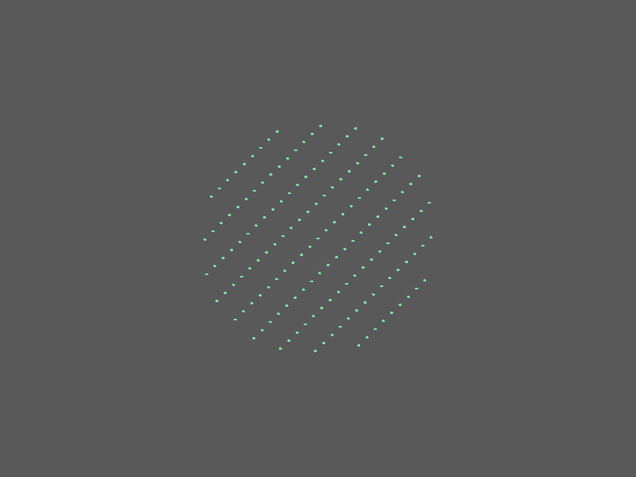

# Báo cáo: TC70 - Culling hạt và indirect draw trên GPU

Đây là báo cáo kiểm thử hai môi trường dùng chung manifest và hợp đồng graph.

## 1. Mô tả và graph dùng chung

- **Manifest:** `crates/ifol-gpu/tests/shared_assets/manifests/tc70_culling.json`
- **Graph fingerprint (FNV-1a):** `208bace8904bea29`
- **Mô tả test case:** Lọc 100.000 hạt vào buffer compact và vẽ indirect bằng instance count do GPU ghi.
- **Target:** `800x600`, `Rgba8UnormSrgb`
- **Shader/WGSL:** `compute_cull.wgsl`, `render_culled.wgsl`
- **Asset/input:** KHÔNG KHAI BÁO
- **Chính sách input:** Desktop và WebGPU tạo cùng positions deterministic, cull center [0,0] và radius 0.5; indirect counter được reset trước warm.
- **Depth/stencil:** `Không áp dụng`
- **Chuỗi pass:** cull_pass (GPU stream compaction, target compact_buffer) → render_pass (Indirect compacted particles, target final)
- **Số pass:** `2`
- **Độ sâu graph:** `KHÔNG ÁP DỤNG`
- **Hierarchy:** `Không khai báo`
- **Thứ tự operation sau flatten:** `cull_particles → draw_indirect`
- **Sampler contract:** `Không khai báo`
- **Thứ tự layer kỳ vọng:** `cull_pass → render_pass`
- **Graph resources:** nodes=`2`, draw commands=`2`, tổng instances=`0`, procedural particles=`Không khai báo`
- **Node pool contract:** `Không áp dụng`
- **Error/fallback contract:** `Không áp dụng`
- **Desktop/Web dùng cùng manifest fingerprint:** `ĐẠT`

## 2. Môi trường Desktop

- **Thời gian render lần đầu (cold):** `45.0314 ms`
- **Thời gian render lần hai (warm/cache):** `1.1129 ms`
- **Số lần warm được đo:** `1`
- **Output cold và warm giống nhau:** `True`
- **Speedup cold → warm:** `97.5%`
- **Adapter/backend:** `Intel(R) Iris(R) Xe Graphics` / `Vulkan`
- **Phạm vi timing:** `execute_checked + submit queue + device.poll(Wait); không gồm khởi tạo device/pipeline và readback`
- **Phạm vi cô lập/cache:** `DesktopTestHarness mới cho từng TC; state mutable được reset trước warm; không xóa cache nội bộ của driver/GPU`
- **Dữ liệu raw:** `crates/ifol-gpu/tests/outputs/desktop/tc70_culling_desktop.bin`
- **Dấu vân tay raw (FNV-1a):** `ee30dc98edf266dd`
- **SHA-256:** `59453a2038663437d64626f5f47ba7c544b06996a7022fd918bb4ae6083aa944`
- **Ảnh:** 
- **Đánh giá nội dung:** `ĐẠT`
- **Đánh giá bằng vision:** Desktop chỉ hiển thị các hạt xanh trong vùng culling tròn ở trung tâm theo bố cục deterministic; vùng ngoài nền xám rỗng.
- **Graph thực tế:** nodes=2, draw commands=2, instances=0

## 3. Môi trường WebGPU

- **Thời gian render lần đầu (cold):** `297.7000 ms`
- **Thời gian render lần hai (warm/cache):** `3.0000 ms`
- **Số lần warm được đo:** `1`
- **Output cold và warm giống nhau:** `True`
- **Speedup cold → warm:** `99.0%`
- **Adapter:** `gen-12lp`
- **Phạm vi timing:** `1 compute culling dispatch 1563x1 + indirect draw + submit queue + onSubmittedWorkDone; không gồm khởi tạo device/pipeline và readback`
- **Phạm vi cô lập/cache:** `Resource của TC được hủy sau khi hoàn tất; state mutable được reset trước warm; không xóa cache nội bộ của browser/driver/GPU`
- **Dữ liệu raw:** `crates/ifol-gpu/tests/outputs/web/tc70_culling_web.bin`
- **Dấu vân tay raw (FNV-1a):** `ee30dc98edf266dd`
- **SHA-256:** `59453a2038663437d64626f5f47ba7c544b06996a7022fd918bb4ae6083aa944`
- **Ảnh:** 
- **Đánh giá nội dung:** `ĐẠT`
- **Đánh giá bằng vision:** WebGPU hiển thị cùng đám hạt xanh trung tâm và vùng ngoài rỗng; indirect draw không tạo hạt rác.
- **Graph thực tế:** nodes=2, draw commands=2, instances=0

## 4. So sánh và kết luận

| Tiêu chí | Kết quả |
| --- | --- |
| Graph/manifest giống nhau | `ĐẠT` |
| Kích thước dữ liệu raw giống nhau | `ĐẠT` |
| Byte raw giống tuyệt đối | `ĐẠT` |
| Số byte khác nhau | `0` |
| Số pixel khác nhau | `0` |
| Sai số kênh màu lớn nhất | `0/255` |
| Khác biệt màu/presentation | `KHÔNG` |
| Số pixel non-background Desktop/Web | `KHÔNG ÁP DỤNG` |
| Bounding box Desktop | `KHÔNG ÁP DỤNG` |
| Bounding box WebGPU | `KHÔNG ÁP DỤNG` |
| Bounding box non-background giống nhau | `ĐẠT` |
| Số pixel mask khác nhau | `0` (ngưỡng `0`) |
| Parity cấu trúc không phụ thuộc màu | `ĐẠT` |
| Cache giữ nguyên output cold/warm ở cả hai môi trường | `ĐẠT` |
| Validation/fallback contract không panic | `ĐẠT` |
| Đúng mô tả test case | `ĐẠT` |

**Kết luận:** `ĐẠT - output giống tuyệt đối từng byte.`

## 5. Phân tích hiệu suất

Các giá trị trên đo thời gian thực thi graph, submit lệnh và chờ GPU hoàn tất;
không bao gồm khởi tạo device/pipeline hoặc readback. Vì vậy `cold` ở đây là
lần execute đầu sau khi resource/pipeline đã được tạo, không phải cold start
của toàn bộ ứng dụng. Giá trị dưới `1 ms` tương đương microsecond và cần được
đọc theo đơn vị đó khi phân tích.
