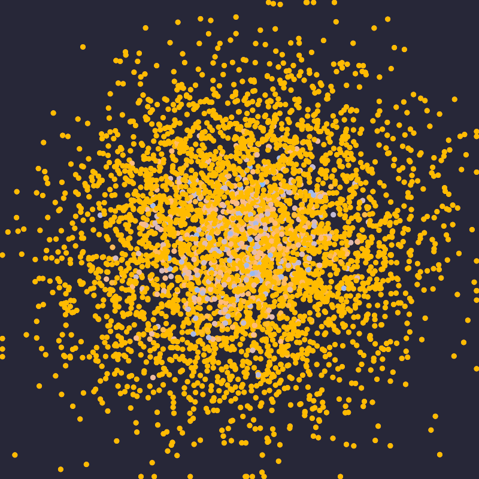
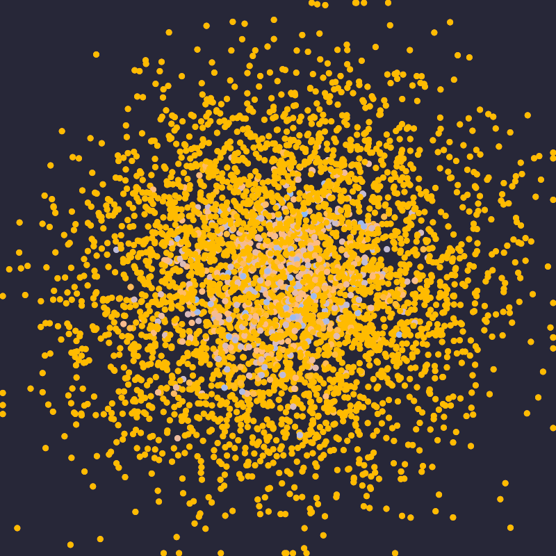

# Báo cáo: TC72 - Mô phỏng spatial hash particle trên GPU

Đây là báo cáo kiểm thử hai môi trường dùng chung manifest và hợp đồng graph.

## 1. Mô tả và graph dùng chung

- **Manifest:** `crates/ifol-gpu/tests/shared_assets/manifests/tc72_spatial_hash.json`
- **Graph fingerprint (FNV-1a):** `f0d3f863afc86ad0`
- **Mô tả test case:** Băm 4.096 particle vào lưới 32x32 và mô phỏng 10 vòng va chạm trước khi render.
- **Target:** `800x800`, `Rgba8UnormSrgb`
- **Shader/WGSL:** `render_spatial_hash.wgsl`
- **Asset/input:** KHÔNG KHAI BÁO
- **Chính sách input:** Desktop và WebGPU tạo cùng particle positions/velocities/colors, grid 32x32, cell size 25 và dt 0,16.
- **Depth/stencil:** `Không áp dụng`
- **Chuỗi pass:** simulation_pass (10-step spatial hash simulation, target particle_buffer) → render_pass (Particle collision field, target final)
- **Số pass:** `2`
- **Độ sâu graph:** `KHÔNG ÁP DỤNG`
- **Hierarchy:** `Không khai báo`
- **Thứ tự operation sau flatten:** `spatial_hash_simulation → render_particles`
- **Sampler contract:** `Không khai báo`
- **Thứ tự layer kỳ vọng:** `simulation_pass → render_pass`
- **Graph resources:** nodes=`2`, draw commands=`31`, tổng instances=`4096`, procedural particles=`Không khai báo`
- **Node pool contract:** `Không áp dụng`
- **Error/fallback contract:** `Không áp dụng`
- **Desktop/Web dùng cùng manifest fingerprint:** `ĐẠT`

## 2. Môi trường Desktop

- **Thời gian render lần đầu (cold):** `42.2194 ms`
- **Thời gian render lần hai (warm/cache):** `34.1896 ms`
- **Số lần warm được đo:** `1`
- **Output cold và warm giống nhau:** `True`
- **Warm diff chi tiết:** `bytes=0, pixels=0, max_delta=0/255, tolerance=0`
- **Speedup cold → warm:** `19.0%`
- **Adapter/backend:** `Intel(R) Iris(R) Xe Graphics` / `Vulkan`
- **Phạm vi timing:** `execute_checked + submit queue + device.poll(Wait); không gồm khởi tạo device/pipeline và readback`
- **Phạm vi cô lập/cache:** `DesktopTestHarness mới cho từng TC; state mutable được reset hoặc ghi đè trước warm; không xóa cache nội bộ của driver/GPU`
- **Dữ liệu raw:** `crates/ifol-gpu/tests/outputs/desktop/tc72_spatial_hash_desktop.bin`
- **Dấu vân tay raw (FNV-1a):** `37ab27368b94bc6a`
- **SHA-256:** `e07543eb17d11feb5e8e44375047ccb3c064db694766c39be0b5b76400319df1`
- **Ảnh:** 
- **Đánh giá nội dung:** `ĐẠT`
- **Đánh giá bằng vision:** TC72: Desktop hiển thị trường particle vàng dày tập trung quanh tâm trên nền tối; phù hợp mô tả spatial hash và simulation.
 - **Numeric validation:** `{"bounded_particle_count": 4096, "finite_particle_count": 4096, "grid_size": 32, "iteration_count": 10, "particle_buffers": 2, "particle_count": 4096, "seed_reset_before_warm": true, "state_update": "source_to_destination_ping_pong"}`
- **Graph thực tế:** nodes=2, draw commands=31, instances=4096

## 3. Môi trường WebGPU

- **Thời gian render lần đầu (cold):** `45.9000 ms`
- **Thời gian render lần hai (warm/cache):** `32.9000 ms`
- **Số lần warm được đo:** `1`
- **Output cold và warm giống nhau:** `True`
- **Warm diff chi tiết:** `bytes=0, pixels=0, max_delta=0/255, tolerance=0`
- **Speedup cold → warm:** `28.3%`
- **Adapter:** `gen-12lp`
- **Phạm vi timing:** `30 compute passes (10 reset/hash/simulate ping-pong iterations) + 4096 instanced draw + submit queue + onSubmittedWorkDone; không gồm khởi tạo device/pipeline và readback`
- **Phạm vi cô lập/cache:** `Resource của TC được hủy sau khi hoàn tất; state mutable được reset trước warm; không xóa cache nội bộ của browser/driver/GPU`
- **Dữ liệu raw:** `crates/ifol-gpu/tests/outputs/web/tc72_spatial_hash_web.bin`
- **Dấu vân tay raw (FNV-1a):** `37ab27368b94bc6a`
- **SHA-256:** `e07543eb17d11feb5e8e44375047ccb3c064db694766c39be0b5b76400319df1`
- **Ảnh:** 
- **Đánh giá nội dung:** `ĐẠT`
- **Đánh giá bằng vision:** TC72: Web hiển thị cùng trường particle vàng tập trung quanh tâm; không thấy NaN, runaway hoặc fallback.
 - **Numeric validation:** `{"particle_count": 4096, "grid_size": 32, "iteration_count": 10, "particle_buffers": 2, "state_update": "source_to_destination_ping_pong", "finite_particle_count": 4096, "bounded_particle_count": 4096, "seed_reset_before_warm": true}`
- **Graph thực tế:** nodes=2, draw commands=31, instances=4096

## 4. So sánh và kết luận

| Tiêu chí | Kết quả |
| --- | --- |
| Graph/manifest giống nhau | `ĐẠT` |
| Kích thước dữ liệu raw giống nhau | `ĐẠT` |
| Byte raw giống tuyệt đối | `ĐẠT` |
| Số byte khác nhau | `0` |
| Số pixel khác nhau | `0` |
| Sai số kênh màu lớn nhất | `0/255` |
| Khác biệt màu/presentation | `KHÔNG` |
| Số pixel non-background Desktop/Web | `190453 / 190453` |
| Bounding box Desktop | `(0, 0, 799, 799)` |
| Bounding box WebGPU | `(0, 0, 799, 799)` |
| Bounding box non-background giống nhau | `ĐẠT` |
| Số pixel mask khác nhau | `0` (ngưỡng `50000`) |
| Parity cấu trúc không phụ thuộc màu | `ĐẠT` |
| Cache giữ nguyên output cold/warm ở cả hai môi trường | `ĐẠT` |
| Warm diff chi tiết đã được ghi nhận | `Desktop: bytes=0, pixels=0, max_delta=0/255, tolerance=0; WebGPU: bytes=0, pixels=0, max_delta=0/255, tolerance=0` |
| Validation/fallback contract không panic | `ĐẠT` |
| Đúng mô tả test case | `ĐẠT` |

**Kết luận:** `ĐẠT - output giống tuyệt đối từng byte.`

## 5. Phân tích hiệu suất

Các giá trị trên đo thời gian thực thi graph, submit lệnh và chờ GPU hoàn tất;
không bao gồm khởi tạo device/pipeline hoặc readback. Vì vậy `cold` ở đây là
lần execute đầu sau khi resource/pipeline đã được tạo, không phải cold start
của toàn bộ ứng dụng. Giá trị dưới `1 ms` tương đương microsecond và cần được
đọc theo đơn vị đó khi phân tích.
