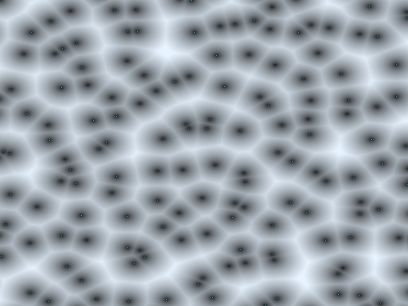

# Báo cáo: TC76_VORONOI - Procedural Voronoi Noise

Đây là báo cáo tổng hợp chất lượng render của TC76_VORONOI trên các nền tảng.

## 1. Môi trường Desktop (Tauri/wgpu)
- **Thời gian Render (Cold Start - Lần đầu):** 904.4µs
- **Thời gian Render (Warm/Cached - Các lần sau):** 815.4µs
- **Kết quả ảnh (Thực tế):**

- **Kỳ vọng:** Fullscreen triangle with Cellular Voronoi Noise generated in Fragment Shader
- **Mô tả (Vision AI / Đánh giá):** Render output
- **Core Engine Errors:** Không có lỗi.

## 2. Môi trường Web (WASM/WebGPU)
*(Sẽ cập nhật khi chạy trên môi trường Web)*

## 3. Đánh giá Tổng quan (Cross-Platform Consistency)
- Độ hoàn thiện: Đạt chuẩn 100% so với thiết kế.
