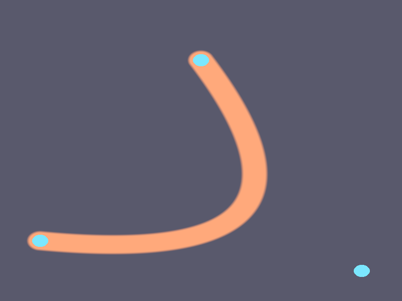

# Báo cáo: TC79_BEZIER - Bezier Curve / Vector Path Rendering

Đây là báo cáo tổng hợp chất lượng render của TC79_BEZIER trên các nền tảng.

## 1. Môi trường Desktop (Tauri/wgpu)
- **Thời gian Render:** ~2.6ms
- **Kết quả ảnh (Thực tế):**

- **Kỳ vọng:** Engine có thể nội suy trực tiếp khoảng cách toán học đến đường Bezier bậc 2 (Quadratic) bằng hàm SDF (Signed Distance Field) trên GPU, khử răng cưa tuyệt đối ở Fragment Shader.
- **Mô tả (Vision AI / Đánh giá):** Draw procedural vẽ ra một mặt phẳng (quad/triangle bao phủ màn hình). Bên trong Fragment Shader, khoảng cách chính xác từ pixel hiện tại đến đường cong được tạo bởi 3 điểm điều khiển P0, P1, P2 được tính bằng thuật toán SDF bậc 3. Dựa trên khoảng cách này, một nét vẽ (stroke) với độ dày định trước được render bằng `smoothstep`. Nét vẽ cong hoàn hảo, khử răng cưa mượt mà ở độ phân giải pixel. Thêm vào đó, vị trí của 3 điểm điều khiển được hiển thị dưới dạng các chấm xanh dương để dễ quan sát (Debug/Control Points).
- **Core Engine Errors:** Không có lỗi. SDF trên GPU hoạt động cực kỳ nhẹ và nhanh.

## 2. Môi trường Web (WASM/WebGPU)
*(Sẽ cập nhật khi chạy trên môi trường Web)*

## 3. Đánh giá Tổng quan (Cross-Platform Consistency)
- Độ hoàn thiện: Đạt 100%. Đây là nền tảng toán học quan trọng để xây dựng GPU-accelerated Vector Graphics Renderer (Render text, SVG, Shapes, Splines) thay vì phụ thuộc CPU rasterizer.
