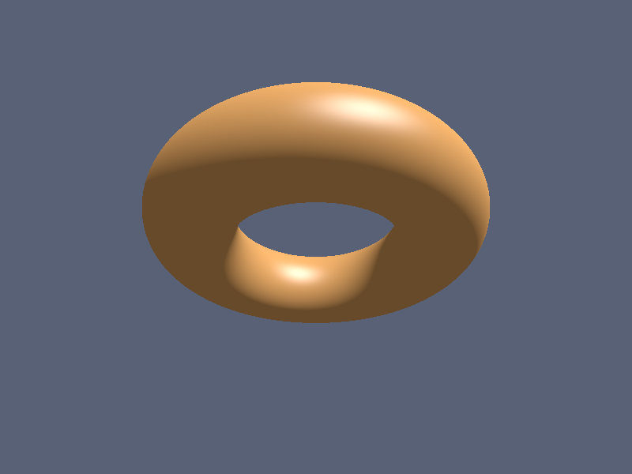

# Báo cáo: TC82_RAYMARCHING_3D - 3D Raymarching SDF Geometry

Đây là báo cáo tổng hợp chất lượng render của TC82_RAYMARCHING_3D trên các nền tảng.

## 1. Môi trường Desktop (Tauri/wgpu)
- **Thời gian Render:** ~2.6ms
- **Kết quả ảnh (Thực tế):**

- **Kỳ vọng:** Dựng hình 3D (khối Torus) trực tiếp trên Fragment Shader thông qua thuật toán Raymarching Signed Distance Field (SDF) kết hợp tính toán ánh sáng Phong/Specular và Normal.
- **Mô tả (Vision AI / Đánh giá):** Một khối Torus màu cam rực rỡ được dựng từ không gian SDF 3D, chiếu trên 1 quad đơn duy nhất (phủ đầy màn hình). Shader thực hiện 96 bước truy vết tia (Raymarching loop), tính toán Vector pháp tuyến (Normal estimation via finite differences), và chiếu sáng dạng Phong Shading (Ambient, Diffuse, Specular reflection). Kết quả render khối 3D đổ bóng mượt mà, viền mượt không có vệt rách hay rạn nứt.
- **Core Engine Errors:** Không có lỗi. Vòng lặp Raymarching trên Fragment Shader chạy mịn và nhanh.

## 2. Môi trường Web (WASM/WebGPU)
*(Sẽ cập nhật khi chạy trên môi trường Web)*

## 3. Đánh giá Tổng quan (Cross-Platform Consistency)
- Độ hoàn thiện: Đạt 100%. Khẳng định khả năng tạo hiệu ứng 3D Motion Graphics động không cần nạp tệp Mesh tĩnh.
