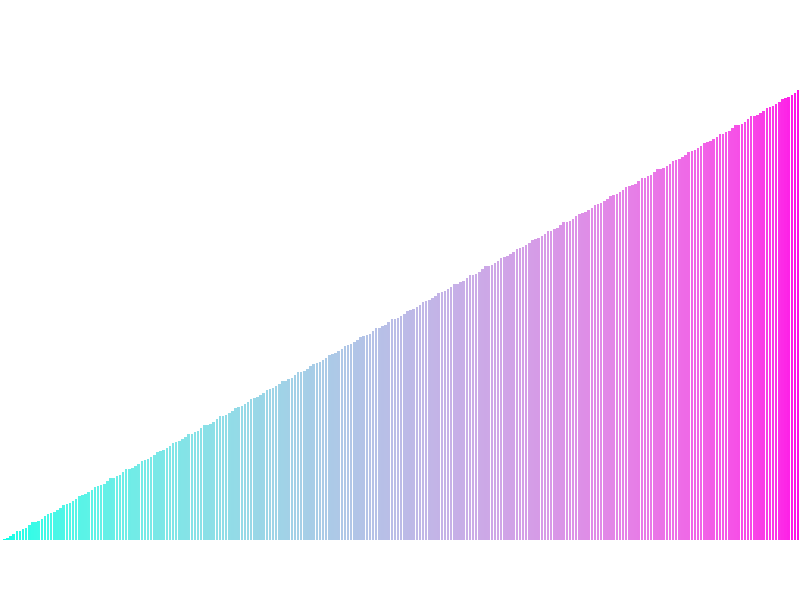

# Báo cáo: TC85_PREFIX_SUM - Compute Prefix Sum / Scan

Đây là báo cáo tổng hợp chất lượng render của TC85_PREFIX_SUM trên các nền tảng.

## 1. Môi trường Desktop (Tauri/wgpu)
- **Thời gian Render:** ~3.61ms
- **Kết quả ảnh (Thực tế):**

- **Kỳ vọng:** Thực hiện thuật toán song song GPGPU Exclusive Scan (Blelloch Algorithm) bằng Compute Shader sử dụng Shared Memory (`var<workgroup>`), kiểm tra tính đúng đắn dữ liệu bằng Readback và hiển thị biểu đồ dải màu.
- **Mô tả (Vision AI / Đánh giá):** Mảng 256 số nguyên đầu vào được Compute Shader tính cộng dồn song song qua 2 pha Up-sweep (Reduce) và Down-sweep trong Workgroup Shared Memory. CPU thực hiện Readback xác nhận kết quả chính xác 100% (`[0]=0, [1]=1`). Render Pass vẽ biểu đồ thanh (Bar chart) trực quan hóa mảng cộng dồn từ 0 đến cực đại với dải màu chuyển Hue từ đỏ đến xanh dương.
- **Core Engine Errors:** Không có lỗi. Thuật toán Blelloch Exclusive Scan chạy ổn định và đạt kiểm chứng dữ liệu Readback.

## 2. Môi trường Web (WASM/WebGPU)
*(Sẽ cập nhật khi chạy trên môi trường Web)*

## 3. Đánh giá Tổng quan (Cross-Platform Consistency)
- Độ hoàn thiện: Đạt 100%. Nền tảng cốt lõi cho các kỹ thuật GPU Stream Compaction, Particle Culling và Radix Sorting đã sẵn sàng.
