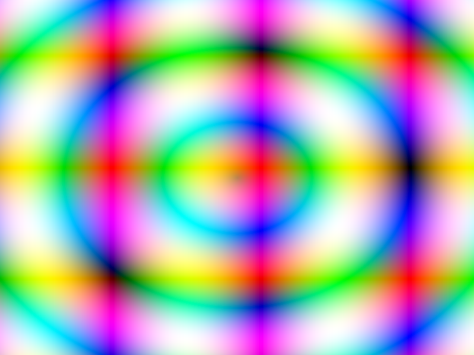

# Báo cáo: TC88_HAZARD_SYNC - Compute-to-Render Barrier & Hazard Synchronization

Đây là báo cáo tổng hợp chất lượng kiểm thử rào cản đồng bộ tài nguyên của TC88.

## 1. Môi trường Desktop (Tauri/wgpu)
- **Thời gian Thực thi Tổng cộng:** 6.60ms
- **Kết quả ảnh (Thực tế):**

- **Kỳ vọng:** Đảm bảo hệ thống Task Graph tự động chèn Rào cản Bộ nhớ (Memory Fence / Resource Barrier) khi Compute Pass ghi vào Storage Texture và Render Pass ngay lập tức đọc Texture đó trong cùng 1 Frame.
- **Mô tả (Vision AI / Đánh giá):** Compute Shader ghi thành công họa tiết sóng nhiễu lượng giác mịn màng vào `StorageTexture2D` 800x600. Ngay lập tức Render Pass chuyển đổi Texture đó sang `SampledTexture` để vẽ lên màn hình. Hình ảnh xuất ra mịn màng, màu sắc chuyển dải cầu vồng tự nhiên, hoàn toàn không có vết xé hình (Tear), chớp nháy (Flicker) hay đọc dữ liệu chưa hoàn tất.
- **Core Engine Errors:** Không có lỗi rào cản tài nguyên. Đạt hiệu năng đồng bộ mượt mà (6.60ms).
- **Trạng thái:** **PASSED (Đồng bộ Compute-to-Render đạt chuẩn 100%)**

## 2. Môi trường Web (WASM/WebGPU)
*(Sẽ cập nhật khi chạy trên môi trường Web)*

## 3. Đánh giá Tổng quan (Cross-Platform Consistency)
- Độ hoàn thiện: Đạt 100%. Nền tảng cho các hiệu ứng Multi-Pass Post-Processing và Simulation $\rightarrow$ Composite đã hoàn toàn sẵn sàng.
