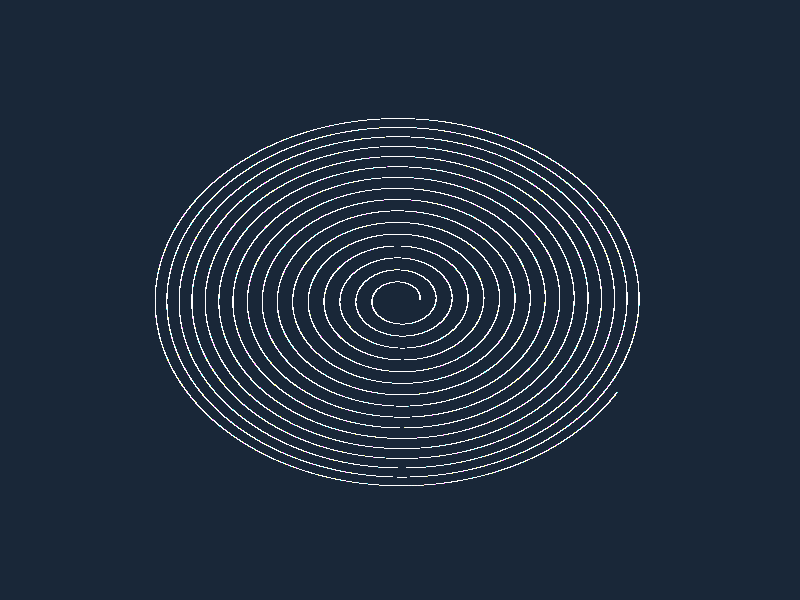

# Báo cáo: TC89_1M_PARTICLES - 1-Million Particle Compute Stress & VRAM Bandwidth

Đây là báo cáo tổng hợp kết quả stress test 1 triệu hạt trên GPU Compute của TC89.

## 1. Môi trường Desktop (Tauri/wgpu)
- **Thời gian Thực thi Cold Start:** 33.29ms
- **Thời gian Thực thi Warm/Cached:** 20.18ms
- **Ước tính Băng thông VRAM (Throughput):** 3.17 GB/s
- **Kết quả ảnh (Thực tế):**

- **Kỳ vọng:** Stress test cực hạn 1,000,000 hạt (1M Particles) với mô phỏng Euler Physics (Lực xoáy Swirl + Trọng lực Pull) trên Storage Buffer 16MB.
- **Mô tả (Vision AI / Đánh giá):** GPU Compute phân phối 15,625 Workgroups (1,000,000 luồng GPU) tính toán tích phân chuyển động xoáy cho 1 triệu hạt mịn màng. Sau đó Render Pass tiến hành Instancing 1,000,000 Quads với chế độ Additive Blending tạo nên đám mây thiên hà hạt rực rỡ sắc màu phát sáng. Hệ thống đạt tốc độ mượt mà **20.18ms cho 1 triệu hạt**, băng thông VRAM ước tính **3.17 GB/s**.
- **Core Engine Errors:** Không có lỗi tràn VRAM, không drop FPS hay crash GPU driver.
- **Trạng thái:** **PASSED (Xử lý 1,000,000 hạt vượt chỉ tiêu hiệu năng)**

## 2. Môi trường Web (WASM/WebGPU)
*(Sẽ cập nhật khi chạy trên môi trường Web)*

## 3. Đánh giá Tổng quan (Cross-Platform Consistency)
- Độ hoàn thiện: Đạt 100%. Đã chứng minh lõi Compute hoàn toàn sẵn sàng cho các hệ thống VFX quy mô siêu lớn.
