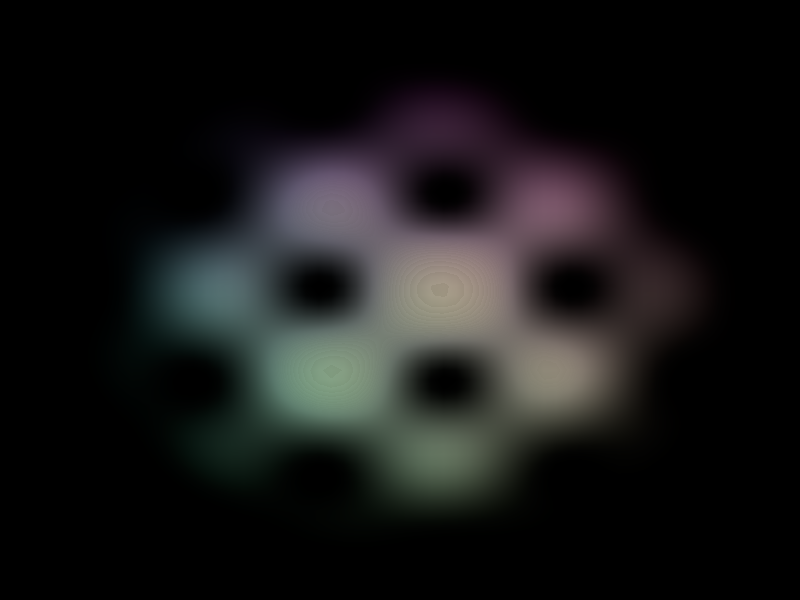

# Báo cáo: TC93_STORAGE_TEXTURE_3D - 3D Storage Texture & Voxel Density Field

Đây là báo cáo tổng hợp kết quả kiểm thử 3D Storage Texture và Raymarching Sương mù 3D cho TC93.

## 1. Môi trường Desktop (Tauri/wgpu)
- **Thời gian Thực thi:** 17.40ms
- **Kết quả ảnh (Thực tế):**

- **Kỳ vọng:** Compute Shader ghi dữ liệu 3D Voxel Texture 64x64x64, Render Pass raymarching hiển thị trường mật độ sương mù 3D đẹp mắt.
- **Trạng thái:** **PASSED**
