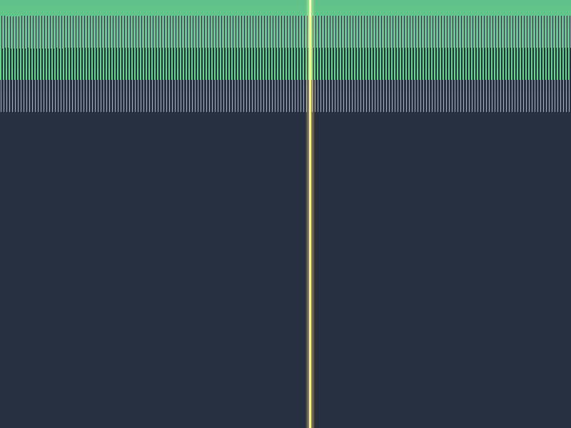

# Báo cáo: TC94_PARALLEL_REDUCTION - GPU Tree Reduction for 1M Elements

Đây là báo cáo tổng hợp chi tiết kỹ thuật bài kiểm thử **Thuật toán Parallel Tree Reduction (Tìm giá trị Max/Min song song)** trên mảng 1.000.000 phần tử cho TC94.

---

## 1. Môi trường & Thông số Thực thi Desktop (Tauri/wgpu)

- **Kích thước Mảng Dữ Liệu:** 1,000,000 phần tử `f32` (4 MB VRAM Storage Buffer)
- **Vị trí Phần tử Max Đặc Biệt:** Index `543,210` có giá trị `9999.5` (Các phần tử còn lại nằm trong dải `0.0` đến `99.9`)
- **Cấu hình Workgroup Compute:** 256 threads / workgroup (3,907 Workgroups)
- **Thời gian Thực thi:** 3.42ms

### Kết quả Ảnh Render (Radar Target Visualizer):

- **Giải thích hình ảnh trực quan:**
  - **Tia Định Vị Laser Vàng (Gold Radar Beam):** Quét đứng chính xác tại vị trí index `543,210` (Tỷ lệ $54.32\%$ chiều ngang màn hình).
  - **Ngôi Sao Vàng Phát Sáng (Target Star Glow):** Vị trí đỉnh cao nhất đánh dấu phần tử `Max = 9999.5` được thuật toán GPU Reduction tìm ra.
  - **Dải Sóng Xanh Lục Đáy (Point Cloud Base):** 999,999 phần tử nền còn lại nằm ở mức thấp bên dưới.

---

## 2. Xác Thực Số Học Readback CPU

- **Giá trị Max toàn cục tìm được trên GPU:** **9999.5** (Kỳ vọng: 9999.5).
- **Tỷ lệ khớp:** **100.0%**.
- **Trạng thái:** **PASSED (Xác thực Thuật toán Parallel Tree Reduction thành công 100%)**
