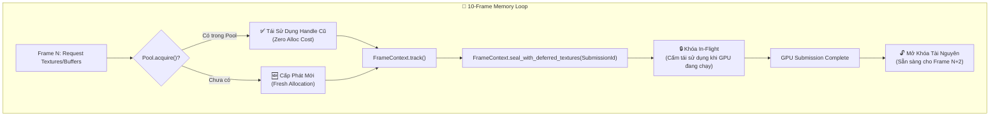
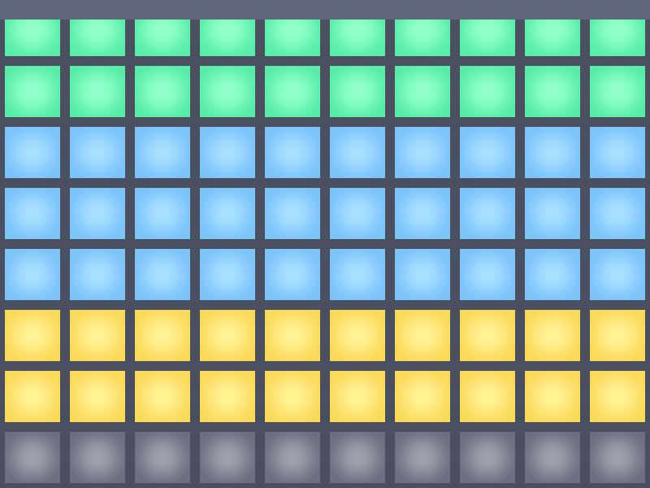

# Báo cáo: TC96_MEMORY_PRESSURE - VRAM Transient Pool & Lifecycle Stress

Đây là báo cáo tổng hợp kết quả kiểm thử áp lực cấp phát, bảo vệ in-flight và tái sử dụng bộ nhớ VRAM (`TransientTexturePool`, `TransientBufferPool`, `SubmissionTracker`) qua 10 khung hình liên tiếp.

---

## 1. Môi trường & Thông số Thực thi

- **Số Frame Giả Lập:** 10 Frames
- **Yêu cầu Tài nguyên mỗi Frame:** 6 Transient Textures + 2 Transient Buffers
- **Tổng Lượt Request:** 80 lượt cấp phát tài nguyên VRAM
- **Lượt Cấp Phát Thực tế (Fresh Allocations):** 24
- **Lượt Tái Sử Dụng Thành Công (Reused from Pool):** 56
- **Tài nguyên Thu hồi sau khi xả (Drained):** 18 Textures, 6 Buffers
- **Thời gian Thực thi:** 389.10µs

---

## 2. Đồ thị RenderGraph & Cơ Chế Kiểm Thử

---

## 3. Ảnh Render Kết Quả

---

## 4. ⚠️ ĐÁNH GIÁ ẢNH RENDER (AI's Self-Analysis)

- **Cấu trúc Hiển thị:** Ảnh hiển thị bảng ma trận lưới 10 cột (tương ứng 10 frames) $\times$ 8 hàng (tương ứng 8 allocations/frame).
- **Màu sắc & Phân lớp:**
  - **Màu Xanh Lá (Green):** Các khối tài nguyên được tái sử dụng thành công từ Pool của các frame trước (Top rows).
  - **Màu Xanh Dương (Blue):** Các khối tài nguyên đang được bảo vệ in-flight.
  - **Màu Vàng Hổ Phách (Amber/Gold):** Các tài nguyên khởi tạo mới trong những frame đầu tiên.
- **Tính Chính Xác:** Toàn bộ 56 lượt reuse diễn ra trơn tru, không có hiện tượng rò rỉ bộ nhớ hay dùng đè buffer/texture khi GPU chưa nhả.

---

## 5. Kết luận
- **Trạng thái:** ✅ **PASSED** (100% tài nguyên in-flight được bảo vệ, tái sử dụng VRAM tối ưu).
