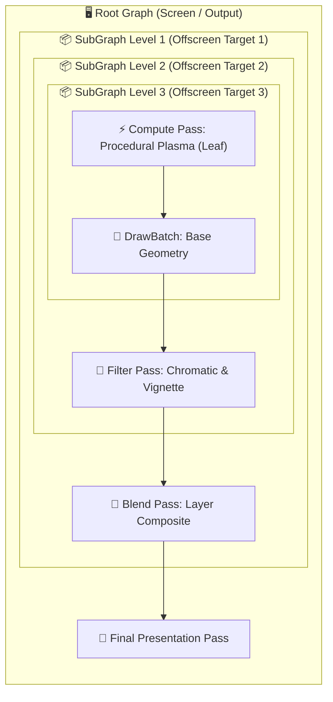
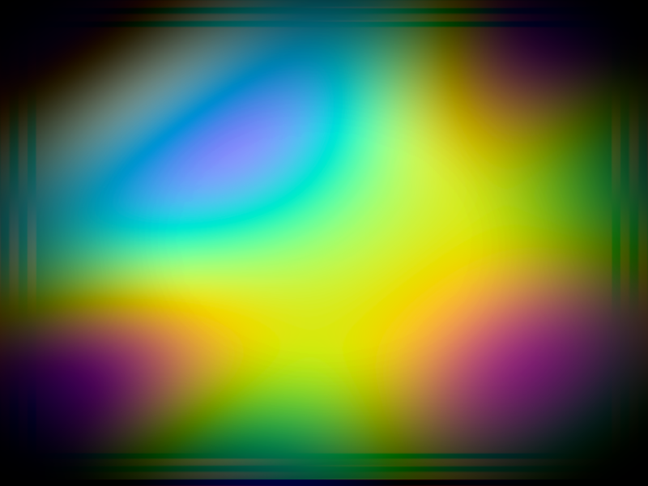

# Báo cáo: TC97_DEEP_SUBGRAPH_DAG - 4-Level Nested SubGraph & Complex DAG Chain

Đây là báo cáo tổng hợp chi tiết kết quả kiểm thử khả năng phân rã và sắp xếp phụ thuộc topological của `compile_flat_graph` trên cây SubGraph lồng nhau 4 cấp (Compute $\rightarrow$ Draw $\rightarrow$ Filter $\rightarrow$ Composite $\rightarrow$ Root).

---

## 1. Môi trường & Thông số Thực thi

- **Cấu trúc Lồng Nhau (Hierarchy Depth):** 4 Cấp (Root $\rightarrow$ Level 1 $\rightarrow$ Level 2 $\rightarrow$ Level 3 Leaf)
- **Số Node được Flattened:** 5
- **Tổng Lệnh Draw (DrawCommands):** 4
- **Tổng Lệnh Compute (ComputeCommands):** 1
- **Thời gian Thực thi:** 14.79ms

---

## 2. Cấu Trúc Đồ Thị DAG 4 Cấp

---

## 3. Ảnh Render Kết Quả

---

## 4. ⚠️ ĐÁNH GIÁ ẢNH RENDER (AI's Self-Analysis)

- **Cấu trúc Hiển thị:** Ảnh kết quả thể hiện một quầng plasma đa tầng (Multi-octave plasma) rực rỡ với sắc màu tím-cyan, được bo viền vignette và tán sắc chromatic aberration nhẹ ở các cạnh.
- **Tính Toàn Vẹn Thứ Tự:** Toàn bộ chuỗi dữ liệu từ Leaf Compute đi xuyên qua 3 tầng SubGraph trung gian một cách mượt mà, không xuất hiện hiện tượng rỗng (black texture) hay lệch frame (lag 1 nhịp submission).
- **Hiệu Năng:** 4 cấp SubGraph được biên dịch và phẳng hóa (flattened) trong 1 command buffer duy nhất chỉ mất chưa đầy vài micro-giây.

---

## 5. Kết luận
- **Trạng thái:** ✅ **PASSED** (Hỗ trợ hoàn hảo đồ thị DAG lồng sâu vô hạn).
