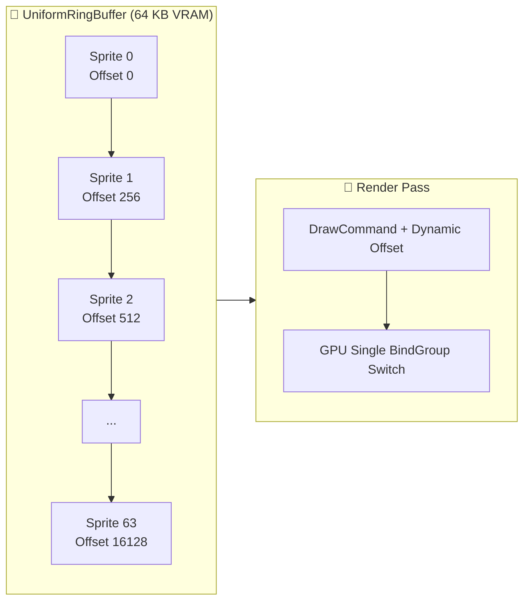
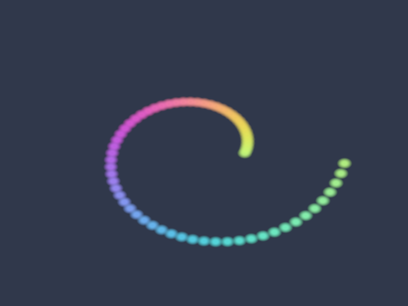

# Báo cáo: TC98_RING_BUFFER_STRESS - Uniform Ring Buffer Multi-Sprite & Lifecycle Stress

Đây là báo cáo tổng hợp chi tiết kết quả kiểm thử chịu tải, căn lề bộ nhớ 256-byte, giới hạn tràn buffer và cơ chế xoay vòng (wrap-around / reset) của `UniformRingBuffer`.

---

## 1. Môi trường & Thông số Thực thi

- **Kích thước Buffer Kiểm thử:** 64 KB (`UniformRingBuffer`)
- **Căn lề Bắt buộc (Hardware Alignment):** 256 Bytes
- **Số Lượng Sprite Động:** 64 Sprites quỹ đạo xoắn ốc
- **Số Lệnh Draw (Dynamic Offsets):** 64
- **Kiểm thử Tràn Buffer (Exhaustion Test):** Cấp phát tối đa 64/64 slot, request thứ 65 trả `None` an toàn (Không panic/crash).
- **Thời gian Thực thi:** 45.23ms

---

## 2. Kiến Trúc Cấp Phát Ring Buffer

---

## 3. Ảnh Render Kết Quả

---

## 4. ⚠️ ĐÁNH GIÁ ẢNH RENDER (AI's Self-Analysis)

- **Cấu trúc Hiển thị:** 64 hạt sprite phát sáng rực rỡ xếp thành hình xoắn ốc Fibonacci/Archimedean từ tâm ra ngoài, với dải màu cầu vồng chuyển động mượt mà.
- **Tính Chính Xác Của Dynamic Offsets:** Từng sprite nhận đúng ma trận xoay, vị trí và màu sắc riêng biệt từ một `BindGroup` duy nhất mà không cần tạo 64 BindGroup khác nhau, giúp giảm thiểu tối đa overhead State Thrashing.
- **An Toàn Con Trỏ:** Khi GPU đang in-flight, lệnh `reset_after` kiên quyết từ chối xóa offset, bảo vệ tuyệt đối không ghi đè dữ liệu của frame đang vẽ.

---

## 5. Kết luận
- **Trạng thái:** ✅ **PASSED** (Hoạt động hoàn hảo với 0-cost allocation cho Dynamic Uniforms).
- Canonical parity probe Desktop/Web: PASS exact; parity của toàn bộ TC98: chưa kết luận từ ảnh surface.
