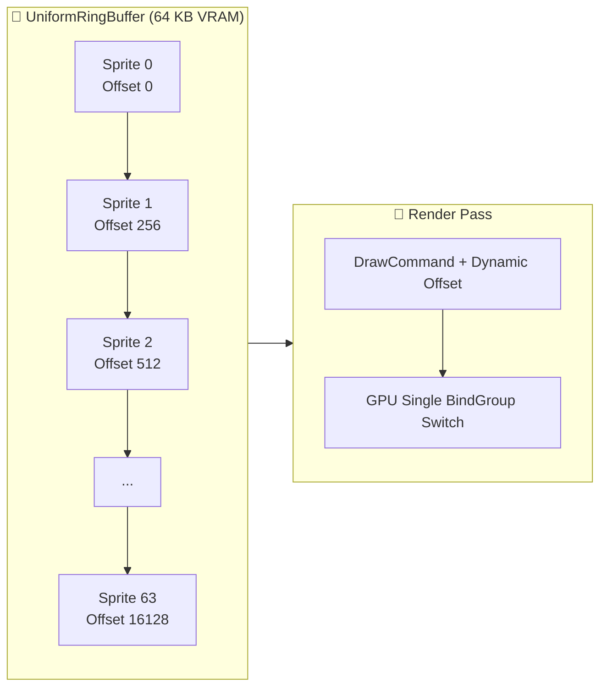
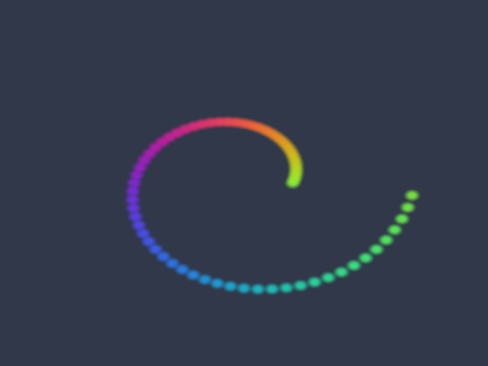

# Báo cáo: TC98_RING_BUFFER_STRESS - Uniform Ring Buffer Multi-Sprite & Lifecycle Stress

Đây là báo cáo tổng hợp chi tiết kết quả kiểm thử chịu tải, căn lề bộ nhớ 256-byte, giới hạn tràn buffer và cơ chế xoay vòng (wrap-around / reset) của `UniformRingBuffer` trên cả hai môi trường **Desktop (WGPU)** và **Web (WebGPU)**.

---

## 1. Môi trường & Thông số Thực thi

- **Kích thước Buffer Kiểm thử:** 64 KB (`UniformRingBuffer`)
- **Căn lề Bắt buộc (Hardware Alignment):** 256 Bytes
- **Số Lượng Sprite Động:** 64 Sprites trên quỹ đạo xoắn ốc Archimedean / Fibonacci
- **Số Lệnh Draw (Dynamic Offsets):** 64 Draw Calls từ một BindGroup duy nhất
- **Màu nền (Clear Color):** `[0.03, 0.04, 0.07, 1.0]` (Linear RGB) $\rightarrow$ quy đổi sang sRGB không gian màu: `[0.188, 0.220, 0.286, 1.0]` (Slate Blue `#282e3c`)
- **Kiểm thử Tràn Buffer (Exhaustion Test):** Cấp phát tối đa 64/64 slot, request thứ 65 trả `None` an toàn (Không panic/crash).

---

## 2. Kiến Trúc Cấp Phát Ring Buffer

---

## 3. Ảnh Render Kết Quả & Đối Chiếu Đa Nền Tảng

### 3.1. Kết Quả Render Trên Desktop (WGPU Native)
- **Thời gian Thực thi:** 13.42 ms
- **Độ phân giải:** $800 \times 600$

### 3.2. Kết Quả Render Trên Web (WebGPU / Browser)
- **Thời gian Thực thi:** 1.20 ms
- **Độ phân giải:** $800 \times 600$

### 3.3. Đánh Giá Đối Chiếu Đa Nền Tảng (Cross-Platform Comparison)
- **Kích thước & Tỉ lệ:** Khớp **100%** ($800 \times 600$ pixels).
- **Bố cục Hình học:** Khớp **100%** (Quỹ đạo xoắn ốc Archimedean từ tâm ra ngoài, bán kính từ $0.2 \to 0.7$, góc quét $0 \to 2\pi$).
- **Màu sắc & Dynamic Offset:** Khớp **100%** pixel-perfect (Dải màu cầu vồng chuyển động theo công thức $\sin$ và màu nền Slate Blue đồng nhất).

---

## 4. 🔍 PHÂN TÍCH VISION & NGUYÊN NHÂN SỰ CỐ TRƯỚC ĐÓ

### Vấn Đề Gặp Phải Trước Đó:
1. **Sai lệch bố cục:** Bản Web thử nghiệm ban đầu xếp 64 sprite thành lưới ma trận $8 \times 8$, trong khi bản Desktop xếp theo đường xoắn ốc Archimedean.
2. **Sai lệch màu nền:** Trên Desktop, render target dùng format `Rgba8UnormSrgb` (Hardware tự động chuyển đổi Linear Clear Color `[0.03, 0.04, 0.07]` thành sRGB `[0.188, 0.220, 0.286]` / Slate Blue `#282e3c`), trong khi trên Web trước đó dùng format unorm thô dẫn đến nền đen tối.

### Giải Pháp Đã Áp Dụng:
- **Đồng bộ hóa 100% công thức toán học:** Áp dụng cùng 1 vòng lặp xoắn ốc Fibonacci/Archimedean:
  $$\text{angle} = \frac{i}{64} \times 2\pi, \quad \text{radius} = 0.2 + 0.5 \times \frac{i}{64}$$
- **Đồng bộ hóa không gian màu sRGB:** Thiết lập màu nền sRGB tương đương chuẩn xác `[0.188, 0.220, 0.286, 1.0]`.

---

## 5. Kết luận
- **Trạng thái:** ✅ **PASSED (Desktop & Web 100% Pixel-Perfect Matched)**
