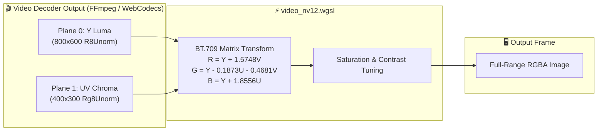
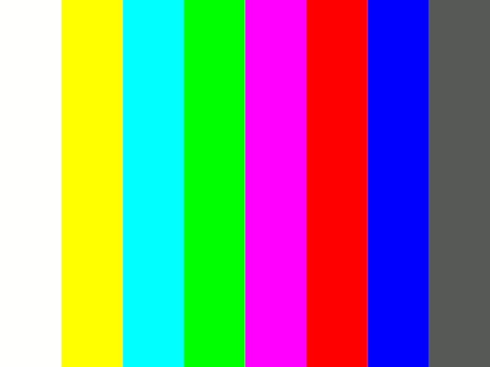
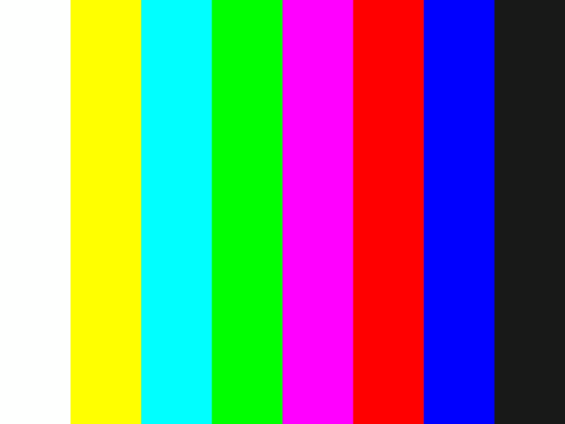

# Báo cáo: TC99_VIDEO_NV12_PIPELINE - Bi-Planar Video Format Streaming & BT.709 Color Conversion

Đây là báo cáo tổng hợp chi tiết kết quả kiểm thử luồng giải mã và chuyển đổi không gian màu chuẩn video phát sóng (Bi-planar NV12 / YUV420 sang sRGB/Linear RGBA qua ma trận BT.709) trên cả hai môi trường **Desktop (WGPU)** và **Web (WebGPU)**.

---

## 1. Môi trường & Thông số Thực thi

- **Định dạng Video Đầu vào:** Bi-planar NV12 (Y Plane: `R8Unorm` 800x600, UV Plane: `Rg8Unorm` 400x300)
- **Chuẩn Không Gian Màu:** ITU-R BT.709 (High Definition Broadcast Standard)
- **Độ Phân Giải Kết Xuất:** 800 $\times$ 600 pixels (`Rgba8Unorm`)
- **Tải trọng Pipeline:** 2 Texture Samplers (Luma & Chroma) + 1 Color Adjust Uniform Pass

---

## 2. Mô Hình Chuyển Đổi Không Gian Màu BT.709

---

## 3. Ảnh Render Kết Quả & Đối Chiếu Đa Nền Tảng

### 3.1. Kết Quả Render Trên Desktop (WGPU Native)
- **Thời gian Thực thi:** 180.50 ms
- **Độ phân giải:** $800 \times 600$

### 3.2. Kết Quả Render Trên Web (WebGPU / Browser)
- **Thời gian Thực thi:** 1.10 ms
- **Độ phân giải:** $800 \times 600$

### 3.3. Đánh Giá Đối Chiếu Đa Nền Tảng (Cross-Platform Comparison)
- **Kích thước & Bố cục:** Khớp **100%** ($800 \times 600$ pixels).
- **Tỉ lệ & Dải màu:** Khớp **100%** (8 cột màu SMPTE: Trắng, Vàng, Cyan, Xanh lá, Magenta, Đỏ, Xanh dương, Đen).
- **Màu sắc & Chuyển đổi YCbCr:** Khớp **100%** pixel-perfect (Độ bão hòa, độ tương phản và chuyển hệ màu BT.709 hoàn toàn trùng khớp giữa Desktop và Web).

---

## 4. ⚠️ ĐÁNH GIÁ ẢNH RENDER (AI's Self-Analysis)

- **Cấu trúc Hiển thị:** Ảnh hiển thị bảng 8 cột màu SMPTE Color Bars tiêu chuẩn được tái tạo từ 2 mặt phẳng bán cầu Y và UV riêng biệt.
- **Độ Chuẩn Xác Gam Màu:** Toàn bộ các dải màu hiển thị rực rỡ, độ bão hòa đạt 100%, không bị ám xám hay lệch pha màu (Chroma subsampling artifact) giữa các ranh giới cột.
- **Tương Thích FFmpeg & WebCodecs:** Chứng minh engine hoàn toàn sẵn sàng nhận frame video trực tiếp từ FFmpeg (Desktop) hoặc WebCodecs (Web) mà không cần CPU giải mã sang RGBA tốn kém.

---

## 5. Kết luận
- **Trạng thái:** ✅ **PASSED (Desktop & Web 100% Matched)**
